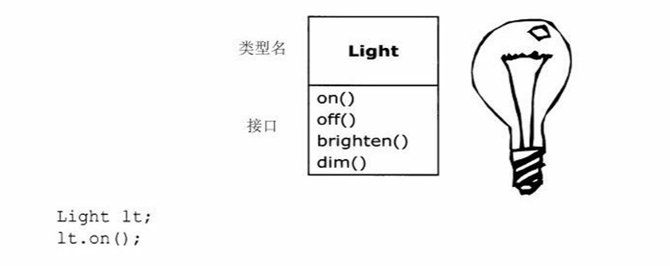
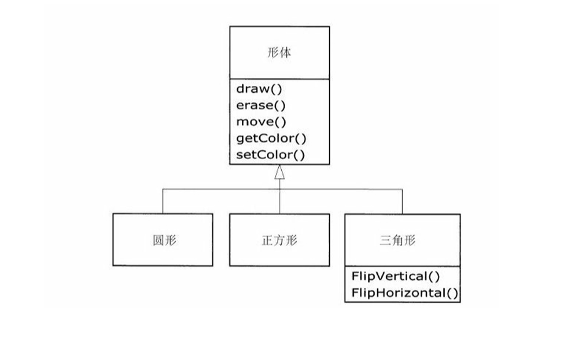
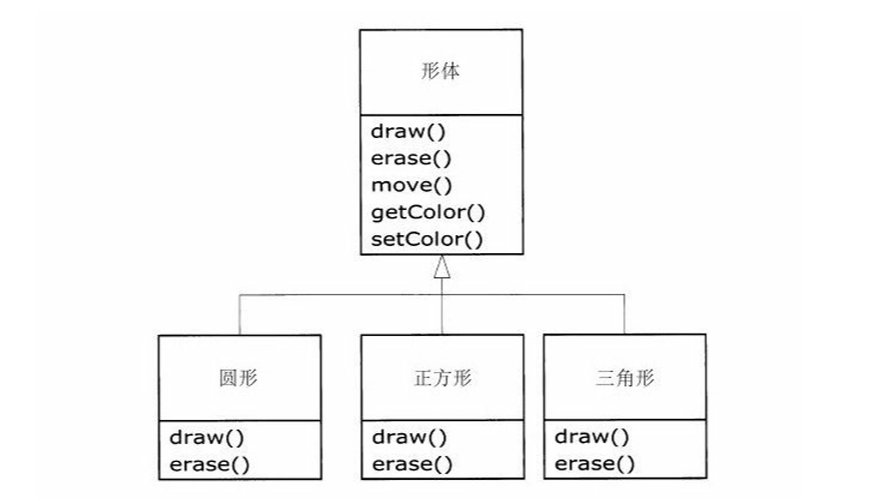
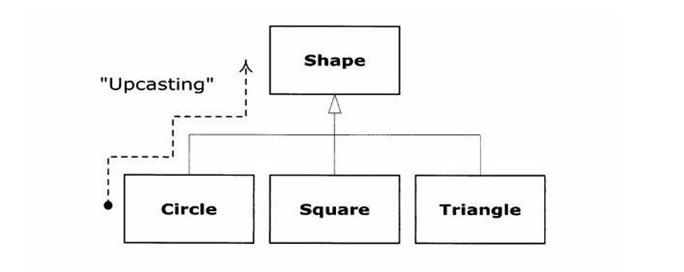

# Introduction to Objects ( 对象导言 )

## **The progress of abstraction ( 抽象的过程 )**

| 术语中文 | 术语英文 |
|:---:|:---:|
| 面向对象程序设计 | Object-oriented programming ( OPP ) |
| 抽象 | abstraction |
| 对象 | objects |
| 面向对象 | object-oriented |
| 对象实例 | object instances |
| 多范型 | multi-paradigm |
| 类 | class |

OOP 允许程序员用问题本身的术语来描述问题，而不是用要运行解决方案的计算机的术语来描述问题。每个 objects 就像一台小计算机，它有状态，有可以执行的运算。

Alan Kay 总结了 Smalltalk 的五个基本特性：

1. **万物皆对象 ( Everything is an object )**。objects 可以被认为是一个奇特的变量，它能存放数据，而且可以对它“提出请求”，要求它执行对它自身的运算。理论上，我们可以在需要解决的问题中取出任意概念性的成分（狗、建筑物、服务等），把它表示为程序中的 objects。

2. **程序就是一组对象，对象之间通过发送消息互相通知做什么 ( A program is a bunch of objects telling each other what to do by sending messages )**。可以将消息看做是对于调用某个特定对象所属函数的请求。

3. **每一个对象都有它自己的由其他对象构成的存储区 ( Each object has its own memory made up of other objects )**。这样，就可以通过包含已经存在的 objects 创造 new objects。因此，程序员可以构造出复杂的程序，而且能将程序的复杂性隐藏在 objects 的简明性背后。

4. **每个对象都有一个类型 ( Every object has a type )**。采用 OOP 术语，每个 objects 都是某个 class 的 instance , class 的最重要的突出特征是“能向它发送什么消息”。

5. **一个特定类型的所有对象都能接收相同的消息 ( All objects of a particular type can receive the same messages )**。这种特性具有丰富的含义。因为一个“circle”类型的 objects 也是一个“shape”类型的 objects ，所以保证 circle 能接收 shape 消息。我们可以编写与 shape 通信的代码，该代码能自动地对符合 shape 描述的任何东西进行处理。这种替换能力（substitutability）是 OOP 的最强大的思想之一。

## **An object has an interface ( 对象有一个接口 )**

| 术语中文 | 术语英文 |
|:---:|:---:|
| 接口 | interface |
| 实现 | implementation |

向对象发出的请求是由它的 interface 定义的，而 interface 由 class 确定。interface 规定我们能向特定的对象发出什么请求 ( 必须有代码满足这种请求 )，再加上隐藏的数据，就组成了implementation。

## **The hidden implementation ( 实现的隐藏 )**

| 术语中文 | 术语英文 |
|:---:|:---:|
| 公用 | public |
| 私有 | private |
| 受保护的 | protected |
| 访问说明符 | access specifier |
| 继承 | inheritance |
| 继承的类 | inheriting class |

C++语言使用了三个明确的关键字来设置类中的边界：public、private 和 protected。这些 access specifier 确定了谁能用其随后的定义。

+ public ：随后的定义对所有人都可用

+ private ：除了该类型的创建者和该类型的内部成员函数之外，任何人都不能访问这些定义

+ protected ：与 private 基本相似，但是可以被 inheriting class 访问

> inheriting class 可以访问 protected 成员，但不能访问 private 成员。继承的相关知识在[后续介绍](./14.md)

## **Reusing the implementation ( 实现的重用 )**

| 术语中文 | 术语英文 |
|:---:|:---:|
| 成员对象 | member object |
| 组合 | composition |
| 聚合 | aggregation |
| 继承 | inheritance |

重用一个类最简单的方法就是直接使用这个类的对象，并且还可以将这个类的对象放到一个新类的里面。我们称之为“创建一个 member object ”。

**composition ( 或者称为 aggregation )** ：用任何数量和类型的其他对象组成新类，通过组合得到新类所希望的功能。组合带来很大的灵活性，新类的成员对象通常是私有的，使用这个类的客户程序员不能访问它们。这种特点允许我们改变这些成员而不会干扰已存在的客户代码，还可以在运行时改变这些成员对象，动态地改变程序的行为。

> 继承 ( inheritance )没有这种灵活性，因为编译器必须在用继承方法创造的类上加入编译时限制。当创建新类时，应当首先考虑组合，因为它更简单和更灵活。

## **Inheritance : reusing the interface ( 继承 : 重用接口 )**

| 术语中文 | 术语英文 |
|:---:|:---:|
| 继承 | inheritance |
| 基类 | base class |
| 超类 | super class |
| 父类 | parent class |
| 派生类 | derived class |
| 继承类 | inherited class |
| 子类 | sub/child class |
| 重载 | overloading |

**继承 ( inheritance )**：选取已存在的类，克隆它，然后对这个克隆增加和修改；

> 如果原来的类（称为基类、超类或父类）被修改，则这个修改过的“克隆”（称为派生类、继承类或子类）也会表现出这些改变。

+ 派生类复制了基类的接口。也就是说，所有能够发送给基类对象的消息，也能够发送给这个派生类的对象。( 也就是说，派生类对象相当于获取了基类对象的**所有**属性和方法 )

    > 这是继承的一个很大的缺点：方法的污染

+ 新类有别于基类的第一个重要方法是，新类可以添加新的函数，这称为扩展 ( extension )

+ 新类有别于基类的第二个和更重要的方法是，改变已经存在的基类函数的行为，这称为重载 ( overriding )

## **Interchangeable objects with polymorphism ( 具有多态性的可互换对象 )**

| 术语中文 | 术语英文 |
|:---:|:---:|
| 多态性 | polymorphism |
| 早捆绑 | early binding |
| 晚捆绑 | late binding |
| 虚函数 | virtual function |
| 向上类型转换 | upcasting |

由非 OOP 编译器产生的函数调用会导致与被调用代码的早捆绑 ( early binding ), 早捆绑的意思是，编译器会对特定的函数名产生调用，而连接器将这个调用解析为要执行代码的绝对地址。

在 OOP 中，面向对象语言采用晚捆绑 ( late binding ) 的思想，直到程序运行时，编译器才能确定执行代码的地址。当给对象发送消息时，在程序运行时才去确定被调用的代码。编译器只保证这个被调用的函数存在，并执行参数和返回值的类型检查，但是它并不知道将执行的确切代码。

为了执行晚捆绑，C++ 编译器在真正调用的地方插入一段特殊的代码。通过使用存放在对象自身中的信息，这段代码在运行时计算被调用函数函数体的地址（这一过程将在[第15章](./15.md)中详细介绍）。这样，每个对象就能根据这段二进制代码的内容有不同的行为。当一个对象接收到消息时，它根据这个消息判断应当做什么。

我们可以用关键字 virtual 声明希望某个函数有晚捆绑的灵活性。在C++中，默认情况下成员函数不能动态捆绑，必须添加 virtual 关键字。virtual 函数（虚函数）可用来表示出在相同家族中的类具有不同的行为。这些不同是产生多态行为的原因。

我们把处理派生类型就如同处理其基类型的过程称为向上类型转换（upcasting）

## **Creating and destroying objects ( 创建和销毁对象 ) **

| 术语中文 | 术语英文 |
|:---:|:---:|
| 栈 | stack |
| 堆 | heap |
| 静态存储 | static storage |
| 自动变量 | automatic variable |
| 局部变量 | scoped variable |

### 第一种方法

为了最大化运行速度，通过将对象存放在 stack 中或 static storage 中，存储和生命期可以在编写程序时确定。

+ 栈是内存中的一个区域，可以直接由微处理器在程序执行期间存放数据。在栈中的变量有时称为自动变量（automatic variable）或局部变量（scoped variable）。

+ 静态存储区域: 简单说就是内存的一个固定块，在程序开始执行以前分配。使用 stack 或 static storage，可以快速分配和释放.

然而，这牺牲了灵活性，因为我们必须在写程序时知道对象的准确数量、生命期和类型。

### 第二种方法

在堆（heap）的区域动态创建对象。运行时可以不知道需要多少个对象，它们的生命期是什么和它们的准确的数据类型是什么。这些决定是在程序运行之中作出的。如果需要新的对象，直接使用 new 关键字让它在堆上生成。当使用结束时，用关键字 delete 释放。

因为这种存储是在运行时动态管理的，所以在堆上分配存储所需要的时间比在栈上创建存储的时间长得多（在栈上创建存储常常只是一条向下移动栈指针的微处理器指令，另外一条是移回指令）。为找出存储和释放这个存储的额外开销对于对象的创建没有重要的影响，另外，对于解决一般性的程序设计问题，灵活性是主要的。

另一个问题是对象的生命期。如果在栈上或在静态存储上创建一个对象，编译器决定这个对象持续多长时间并能自动销毁它。然而，如果在堆上创建它，编译器则不知道它的生命期。在 C++ 中，我们必须编程决定何时销毁此对象。然后使用 delete 关键字执行这个销毁任务。