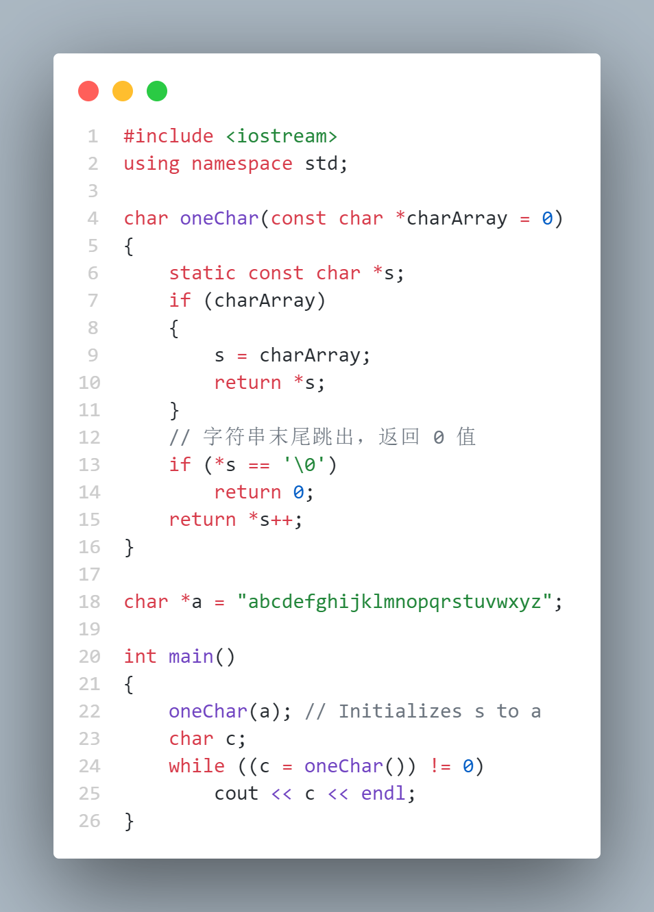
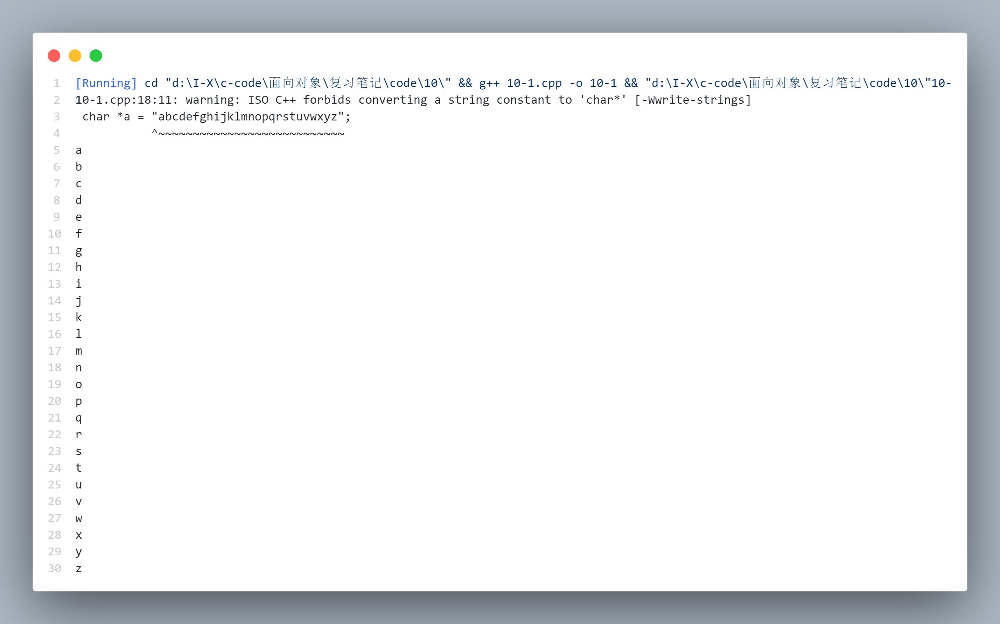
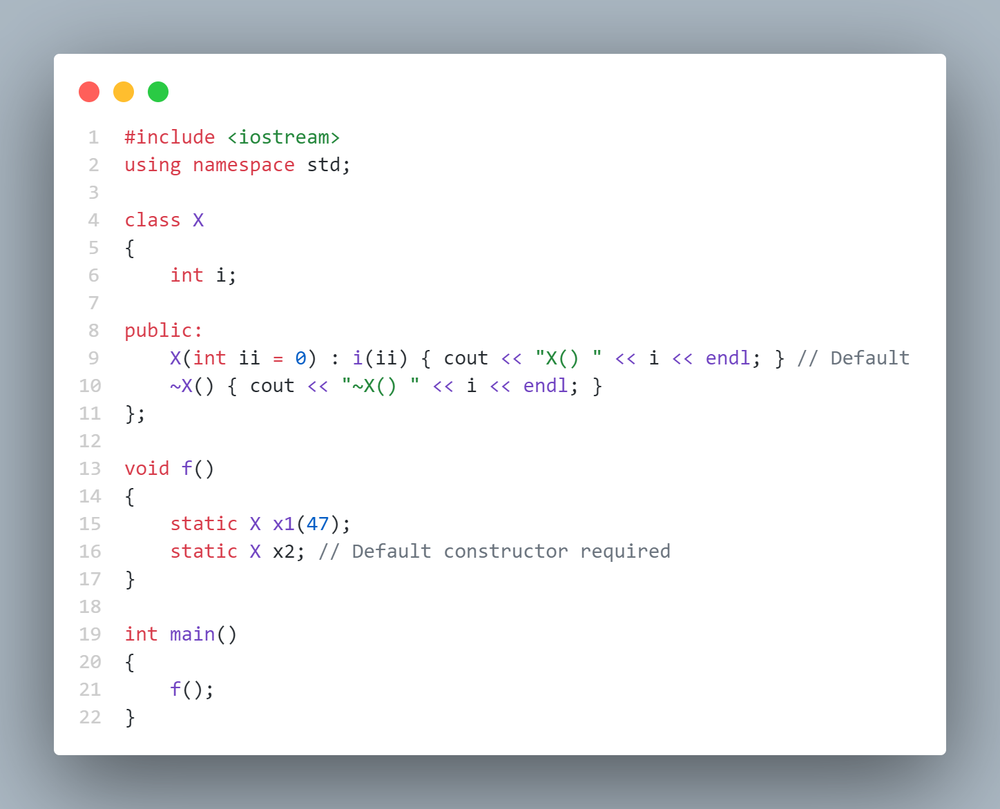
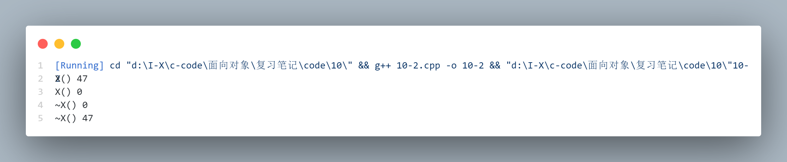
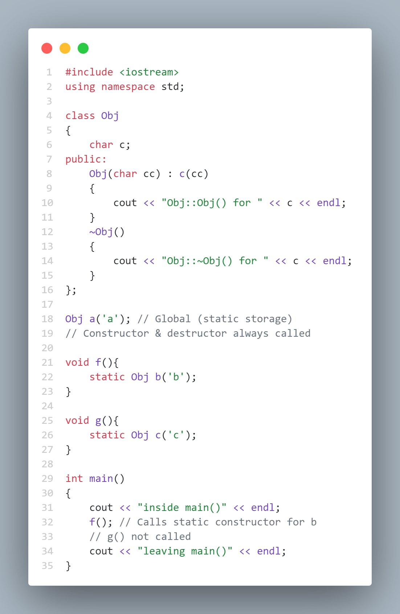
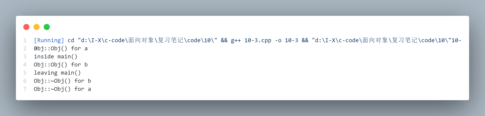

# Name Control ( 名字控制 )

创建名字是程序设计过程中一项最基本的活动，当一个项目很大时，它会不可避免地包含大量的名字。C++ 允许我们对名字的产生和名字的可见性进行控制，包括这些名字的存储位置以及名字的连接。

在本章里，我们将看到 static 如何控制存储和可见性，还将看到一种通过 C++ 的名字空间特征来控制访问名字的改进方法。我们还将发现怎样使用已经采用 C 语言编写和编译过的函数

## Static elements from C ( C 语言中的静态元素 )

| 术语中文 | 术语英文 |
|:---:|:---:|
| 静态存储 | static storage |
| 字符串字面量 | string literal |
| 文件作用域 | file scope |
| 外部连接 | external linkage |
| 内部连接 | internal linkage |

在 C 和 C++ 中，static都有两种基本的含义，并且这两种含义经常是互相冲突的：

+ 在固定的地址上进行存储分配，也就是说对象是在一个特殊的静态数据区 ( static data area ) 上创建的，而不是每次函数调用时在堆栈上产生的。这也是静态存储的概念。

+ 对一个特定的编译单位来说是局部的 ( 就像在后面将要看到的，这在 C++ 中局限于类的范围 )。这样，static 控制名字的可见性 ( visibility )，所以这个名字在这个单元或类之外是不可见的。这也描述了连接的概念，它决定连接器将看到哪些名字。

### **static variables inside functions ( 函数中的静态变量 )**

通常，在函数体内定义一个局部变量时，编译器在每次函数调用时使堆栈的指针向下移一个适当的位置，为局部变量分配内存。如果这个变量有一个初始化表达式，那么每当程序运行到此处，初始化就被执行。

然而，有时想在两次函数调用之间保留一个变量的值，可以通过定义一个全局变量来实现，但这样一来，这个变量就不仅仅只受这个函数的控制。

> 延长生命周期？

C 和 C++ 都允许在函数内部定义一个 static 对象，这个对象将存储在程序的静态数据区中，而不是在堆栈中。**这个对象只在函数第一次调用时初始化一次**，以后它将在两次函数调用之间保持它的值。比如，下面的函数每次调用时都返回一个字符串中的下一个字符

[笔记代码](./code/10/10-1.cpp):



运行结果：



> 这个警告是编译器在 ISO C++ 标准下发出的，因为它不允许将 string literal 直接赋值给 char* 类型的指针。在 C++ 中，字符串字面量是 const char[ ] 类型，它们是常量，不能被修改。当你尝试将一个字符串字面量赋值给 char* ，编译器会警告你这样做可能会导致意外的写操作，因为实际上是在尝试修改一个常量。

一个静态对象的初始化（与其他对象的初始化一样）可以是任意的常量表达式，如果没有为一个内建类型的静态变量提供一个初始值的话，编译器也会确保在程序开始时它被初始化为零

#### static class objects inside functions ( 函数中的静态类对象 )

关于一般的静态变量的规则同样适用于用户自定义的静态对象，而且它同样也必须有初始化操作。但是，零赋值只对内建类型有效，用户自定义类型必须用构造函数来初始化。因此，如果在定义一个静态对象时没有指定构造函数参数，这个类就必须有默认的构造函数。

[笔记代码](./code/10/10-2.cpp)



运行结果：



#### Static object destructors ( 静态对象析构函数 )

同普通对象的销毁一样，静态对象的销毁也是按与初始化时相反的顺序进行的。当然只有那些已经被创建的对象才会被销毁。

全局对象总是在 main ( ) 执行之前被创建，在退出 main ( ) 时销毁。如果一个包含局部静态对象的函数从未被调用过，那么这个对象的构造函数也就不会执行，这样自然也不会执行析构函数。

[笔记代码](./code/10/10-3.cpp)



运行结果：



> 这就不用解释了吧。。

### **Controlling linkage ( 控制连接 )**

一般情况下，在 file scope 内的所有名字（即不嵌套在类或函数中的名字）对程序中的所有翻译单元来说都是可见的。这就是所谓的 external linkage，因为在连接时这个名字对连接器来说是可见的，对单独的翻译单元来说，它是外部的。全局变量和普通函数都有外部连接。

想限制一个名字的可见性，让一个变量在文件范围内是可见的，这样这个文件中的所有函数都可以使用它，但不想让这个文件之外的函数看到或访问该变量，或不想这个变量的名字与外部的标识符相冲突。在文件作用域内，一个被明确声明为 static 的对象或函数的名字对翻译单元 ( 也就是出现声明的.cpp文件 ) 来说是局部于该单元的, 这些名字是 internal linkage。这意味着可以在其他的翻译单元中使用同样的名字，而不会发生名字冲突。

内部连接的一个好处是这个名字可以放在一个头文件中而不用担心连接时发生冲突。那些通常放在头文件里的名字，如常量、内联函数，在默认情况下都是内部连接的（当然常量只有在 C++ 中默认情况下是内部连接的，在 C 中它默认为外部连接）。注意连接只引用那些在连接/装载期间有地址的成员，因此类声明和局部变量并不连接。

#### Confusion ( 冲突问题 )

下面例子说明了static的两个含义是怎样彼此交叉的。所有的全局对象都是隐含为静态存储的，所以如果定义(在文件作用域 )

```cpp
    int i = 1;
```

则 a 被存储在程序的静态数据区，在进入 main ( ) 函数之前，a 就初始化了。另外，a 对所有的翻译单元都是全局可见的。用可见性术语来讲，static ( 只在翻译单元内可见 ) 的反义是 extern，它明确地声明了这个名字对所有的翻译单元都是可见的。所以上面的定义和下面的定义是相同的

```cpp
    extern int i = 1;
```

但如果这样定义：

```cpp
    static int i = 1;
```

现在 a 成了一个 internal linkage ，但存储类型没有改变 —— 对象总是驻留在静态数据区，不管是 static 还是 extern。

一旦进入局部变量，static 就不会再改变变量的可见性（这时extern是没有意义的），而只是改变变量的存储类型。如果把局部变量声明为 extern，这意味着某处已经存在一个存储区（所以该变量对函数来说实际上是全局的）：

```cpp
    // 在 1.cpp 中
    int i = 5;
    // 在 2.cpp 中
    #include <iostream>
    int main() {
        extern int i;
        std::cout << i;
    }
    // 此时 int i 其实是一个全局变量 
```
对函数名（非成员函数），static和extern只会改变它们的可见性：

```cpp
    // 与下面是等价的
    extern void f();
    void f();

    // 只在本翻译单元内是可见的，称为 file static
    static void f();
```

### **Other storage class specifiers ( 其他存储类说明符 )**

我们会看到 static 和 extern 用得很普遍。另外还有用得较少的两个存储类型说明符。

一个是 auto，人们几乎不用它，因为它告诉编译器这是一个局部变量。auto 是“automatic”的缩写，它指明编译器自动为该变量分配存储空间的方法。实际上编译器总是可以从变量定义时的上下文中判断出这是一个局部变量，所以 auto 是多余的。

还有一个是 register，它说明的也是局部 ( auto ) 变量，但它告诉编译器这个特殊的变量要经常用到，所以编译器应该尽可能地让它保存在寄存器中。它用于优化代码。但各种编译器对这种类型的变量处理方式也不尽相同，它们有时会忽略这种存储类型的指定。一般，如果要用到这个变量的地址，register 指定符通常都会被忽略。应该避免用 register 类型，因为编译器在优化代码方面通常比我们做得更好

## Namespaces ( 名字空间 )

| 术语中文 | 术语英文 |
|:---:|:---:|
| 名字空间 | namespace |
| 作用域运算符 | scope operator |
| 


C++ 的 namespace 特征，把一个全局名字空间分成多个可管理的小空间。

关键字 namespace，如同 class、struct、enum 和 union 一样，把它们的成员的名字放到了不同的空间中去，尽管其他的关键字有其他的目的，但 namespace 惟一的目的是产生一个新的名字空间。

### **Creating a namespace ( 创建一个名字空间 )**

创建一个名字空间与创建一个类非常相似:

```cpp
    namespace my_namespace {
        // Declarations
    }
```

这就产生了一个新的名字空间，其中包含了各种声明.

+ namespace只能在全局范围内定义，但它们之间可以互相嵌套。

+ namespace定义的结尾，右花括号的后面不必跟一个分号。

+ 可以按类的语法来定义一个 namespace，定义的内容**可在多个头文件中延续**

    > 就是可以在多个头文件中定义同名 nammespace, 内容是延续的

+ namespace的名字可以用另一个名字来作它的别名

```cpp
    namespace my_namespace {
        // Declarations
    }
    namespace Mns = my_namespace;
```

#### Unnamed namespaces ( 未命名名字空间 )

每个翻译单元都可包含一个未命名的名字空间 —— 可以不用标识符而只用“namespace”增加一个名字空间

```cpp
    namespace {
        // Declarations
    }
```

在这个空间中的名字自动地在翻译单元内无限制地有效, 但要确保每个翻译单元只有一个未命名的名字空间。

如果把一个局部名字放在一个未命名的名字空间中，不需要加上 static 说明就可以让它们作内部连接。

> 看不懂思密达

#### Friends ( 友元 )

可以在一个名字空间的类定义之内插入一个 friend 声明：

```cpp
    namespace Me {
        class Us {
            //...
            friend void you();
        };
    }
```

这样函数 you ( ) 就成了名字空间 Me 的一个成员

### **Using a namespace ( 使用一个名字空间 )**

在一个名字空间中引用一个名字可以采取两种方法：

+ 使用作用域运算符

+ 使用 using 指令把所有名字引入到名字空间中

#### Scope resolution ( 域解析 )

名字空间中的任何名字都可以用作用域运算符作明确地指定，就像引用一个类中的名字一样：

```cpp
    namespace X {
        class Y {
            static int i;
        public:
            void f();
        };
        class Z;
        void func();
    }
    int X::Y::i = 9;

    class X::Z {
        int u, v, w;
    public:
        Z(int i);
        int g();
    }; 

    X::Z::Z(int i) { u = v = w = i; }
    int X::Z::g() { return u = v = w = 0; }
    void X::func() {
        X::Z a(1);
        a.g();
    }
    int main(){}
```

注意定义 X：Y：i 就像引用一个类 Y 的数据成员一样容易，Y 如同被嵌套在类 X 中而不像是被嵌套在名字空间 X 中。

#### The using directive ( using 指令 )

用 using 关键字可以让我们立即进入整个名字空间，摆脱输入一个名字空间中完整标识符的烦恼。这种 using 和 namespace 关键字的搭配使用称为 using directive。using 关键字声明了一个名字空间中的所有名字是在当前范围内.

> 想象把一个木桶中的方块倒入当前在的木桶

有一些问题：

+ 当前名字空间优先级高于 using 导入的, 所以如果两个名字空间都有相同的名字，那么在当前名字空间中，这个名字会引用当前名字空间中的那个。

    > 如果希望使用导入的名字空间中的名字，就必须使用作用域运算符进行选择。

+ 多个 using 导入可能产生同名冲突

#### The using declaration ( using 声明 )

可以用 using declaration 一次性引入名字到当前范围内。这种方法不像 using 指令那样把那些名字当成当前范围的全局名来看待，using 声明是在当前范围之内进行的一个声明，这就意味着在这个范围内它可以不顾来自 using 指令的名字。

```cpp
    using namespace X;
    using Y::fun(); // 会默认使用 Y 名字空间的 fun()
```

### **The use of namespaces ( 使用名字空间的方法 )**

不要把一个全局的using指令引入到一个头文件中，因为那将意味着包含这个头文件的任何其他头文件也会打开这个名字空间（头文件可以被另一个头文件包含）

## Static members in C++ ( C++ 中的静态成员 )

把一个数据当成全局变量那样去存储，但又被隐藏在类的内部，并且清楚地与这个类相联系，这可以用类的静态数据成员来实现。类的静态成员拥有一块单独的存储区，不管创建了多少个该类的对象。

所有的这些对象的静态数据成员都共享这一块静态存储空间，这就为这些对象提供了一种互相通信的方法。但静态数据属于类，它的名字只在类的范围内有效，并且可以是 public、private 或者 protected。

### **Defining storage for static data members ( 定义静态数据成员的存储 )**

因为类的静态数据成员有着单一的存储空间而不管产生了多少个对象，所以其存储空间必须在一个单独的地方定义。编译器不会分配存储空间。如果一个静态数据成员被声明但没有定义时，连接器会报错。

定义必须出现在类的外部（不允许内联）而且只能定义一次，因此它通常放在一个类的实现文件中。

```cpp
    class A{
        // 声明
        static int i;
    public:
        // ...
    }

    //  定义静态数据成员，分配存储空间在 A
    int A::i = 1;
    // 如果静态数据成员是一个带构造函数的对象时，可以调用构造函数来代替“=”操作符；如下
    int A::i(1);
```

#### static array initialization ( 静态数组初始化 )

[第 8 章](./8.md)介绍了 static const 变量，它允许在一个类体中定义一个常量值。也可以创建静态对象数组，包括 const 数组与非 const 数组。这同前面的语法是一致的。

```cpp
    class A{
        int i;
        static const int scInts[];
    public:
        A(int ii) : i(ii) {}
        //..
    }

    const int A::scInts[] = {1, 2, 3, 4, 5};
    
    class B{
        static A a;
        static A a1[];
        static const A a2;
        static const A a3[];
    }

    A B::a(1);
    A B::a1[5] = {A(1), A(2), A(3), A(4), A(5)};
    const A B::a2(1);
    const A B::a3[5] = {A(1), A(2), A(3), A(4), A(5)};
```

### **Nested and local classes ( 嵌套和局部类 )**

嵌套类：

```cpp
    class Outer {
        class Inner {
            static int i;
        };
    }
```

局部类( 函数内部类 ) 不能有静态数据成员

### **static member functions ( 静态成员函数 )**

对于数据成员来说，static关键字指定它对类的所有对象来说，都只占有相同的一块存储空间。与定义对象的静态使用相对应，静态函数意味着对这个函数的所有调用来说，一个局部变量只有一份拷贝.

+ 可以不使用对象调用，但必须使用类名来调用。

```cpp
    class X {
    public:
        static void f(){};
    };

    int main() {
        X x;
        x.f();
        x->f();
        X::f();
    } 
```
    > 静态成员是与一个类相连，而不是与一个特定的对象相连

+ 静态成员函数不能访问非静态数据成员

+ 静态成员函数不能调用非静态成员函数

    > 通常，当前对象的地址（this）是被隐式地传递到被调用的函数的。但一个静态成员函数没有 this，所以它无法访问一般的成员和成员函数

这里有一个有趣的特点：因为静态成员对象的初始化方法，所以可以把上述类的一个静态数据成员放到那个类的内部。下面是一个例子，它把构造函数变成私有的，这样 Egg 类只有一个惟一的对象存在，可以访问那个对象，但不能产生任何新的 Egg 对象

```cpp
    #include <iostream>
    using namespace std;

    class Egg {
        static Egg e;
        int i;
        Egg(int ii) : i(ii) {}
        Egg(const Egg&); // Prevent copy-construction
    public:
        static Egg* instance() { return &e; }
        int val() const { return i; }
    };

    Egg Egg::e(47);

    int main() {
        //!  Egg x(1); // Error -- can't create an Egg
        // You can access the single instance:
        cout << Egg::instance()->val() << endl;
    } 
```

E 的初始化出现在类的声明完成后，所以编译器已有足够的信息为对象分配空间并调用构造函数为了完全防止创建其他对象，还需要再做如下的工作：增加一个叫做  copy constructor 的私有构造函数。到目前为止，还不知道为什么必须这样做，因为在[第 11 章](./11.md)中才会讨论拷贝构造函数。然而，如果删除上面例子中定义的拷贝构造函数，那么就能像下面那样创建一个 Egg 对象

```cpp
    Egg e = *Egg::instance();
    Egg e2(*Egg::instance());
```

这两条语句都使用了拷贝构造函数，所以为了禁止这种可能性，拷贝构造函数声明为私有的（不需要定义，因为它不会被调用）

## Static initialization dependency ( 静态初始化依赖 )

函数内部的静态对象在函数第一次被调用时初始化，且只被初始化一次。对于任何初始化依赖因素来说，可以把一个静态对象放在一个能返回对象引用的函数中。使用这种方法，访问静态对象的惟一途径就是调用这个函数。如果该静态对象需要访问其他依赖于它的静态对象时，就必须调用那些对象的函数。函数第一次被调用时，它强迫初始化发生。静态初始化的正确顺序是由设计的代码而不是由连接器任意指定顺序来保证的

> 看不懂思密达，强制初始化吗？或许只需要通过设计就能避开问题？