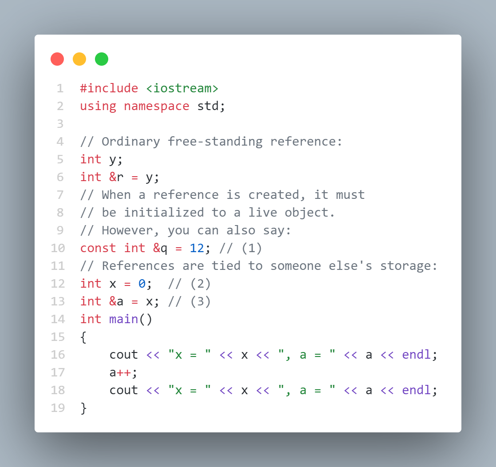
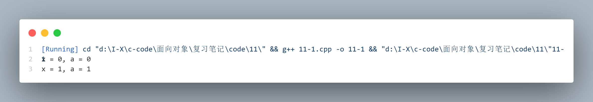
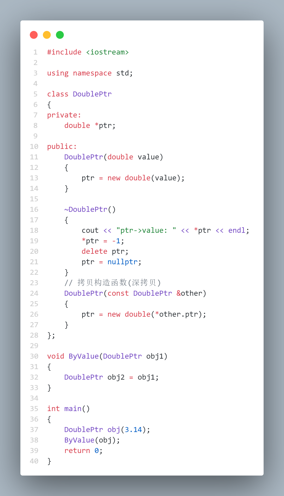
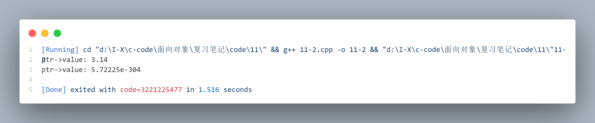
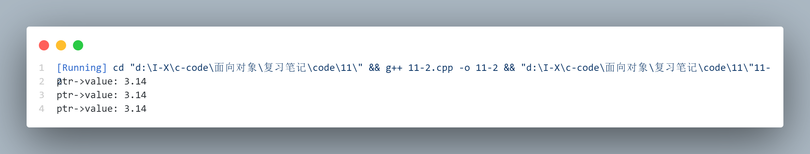
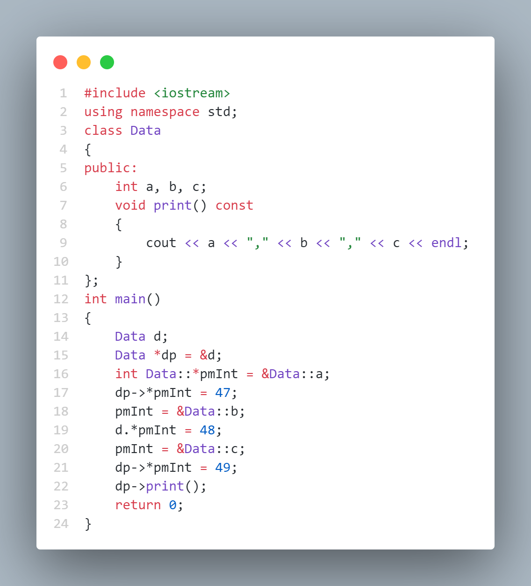
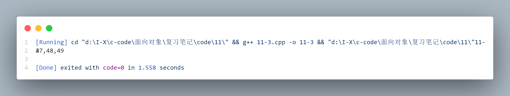

# References & the Copy-Constructor (  引用与拷贝构造函数 )

**引用就像是能自动地被编译器间接引用的常量型指针**

虽然引用 Pascal 语言中也有，但 C++ 中引用的思想来自于 Algol 语言。在 C++ 中，引用是支持运算符重载语法的基础 ( 见[第 12 章](./12.md))，也为函数参数的传入和传出控制提供了便利

本章首先简单地介绍一下C和C++的指针的差异，然后介绍引用。但本章的大部分内容将研究对于 C++ 新手来说比较含混的问题：copy-constructor。

Copy-constructor 是一种特殊的构造函数，需要用引用来实现从现有的相同类型的对象中产生新的对象。编译器使用 copy-constructor 通过 by value 的方式在函数中传递和返回对象。

本章最后将阐述有点难以理解的 C++ 的 pointer-to-member 这个概念。

## Pointers in C++ ( C++ 中的指针 )

C 和 C++ 指针的最重要的区别在于 C++ 是一种类型要求更强的语言，不允许把一个类型的指针赋值给另一个指针。

## References in C++ ( C++ 中的引用 )

| 术语中文 | 术语英文 |
|:---:|:---:|
| 引用 | reference |

如何使用： [笔记代码](./code/11/11-1.cpp)



运行结果：



使用引用时有一定的规则：

> 任何引用必须和存储单元联系。访问引用时，就是在访问那个存储单元。

+ 当引用被创建时，它必须被初始化（指针则可以在任何时候被初始化）

+ 一旦一个引用被初始化为指向一个对象，它就不能改变为另一个对象的引用（指针则可以在任何时候指向另一个对象）

+ 不可能有 NULL 引用。必须确保引用是和一块合法的存储单元关联

### **References in functions ( 函数中的引用 )

当引用被用做函数参数时，在函数内任何对引用的更改将对函数外的参数产生改变。当然，可以通过传递一个指针来做相同的事情，但引用具有更清晰的语法。

#### const references ( 常量引用 )

参数为常引用，允许函数在任何情况下使用。这意味着，对于内建类型，这个函数不会改变参数，而对于用户定义的类型，该函数只能调用常量成员函数，而且不应当改变任何公共的数据成员。

临时变量按引用传递给一个函数时，这个函数的参数必须是 const 引用

> 前面我们提到编译器会使所有的临时量自动地成为 const，对于非 const 引用，可能会修改临时变量，而临时变量被编译器自动地设为 const，会报错

#### Pointer references ( 指针引用 )

在 C 语言中，如果想改变指针本身而不是它所指向的内容，函数声明可能像这样

```cpp
    void f(int**);
    // 当传递它时，必须取得指针的地址
    int i = 47;
    int *ip = &i;
    f(&ip); 
```

对于 C++ 中的引用，语法清晰多了。函数参数变成指针的引用，用不着取得指针的地址：

```cpp
    #include <iostream>
    using namespace std;

    void increment(int *&i) { i++; }

    int main() {
        int *i = 0;
        cout << "i = " << i << endl;
        increment(i);
        cout << "i = " << i << endl;
    }
```

### **Argument-passing guidelines ( 传递参数的准则 )**

当给函数传递参数时，人们习惯上是通过常量引用来传递。但像本章以后部分介绍的，这将会带来很多的危险。拷贝构造函数需要通过传值方式来传递对象，但这并不总是可行的。

事实上，只有一种情况不适合用传递地址方式，这就是当传值是惟一安全的途径，否则将会破坏对象时（不想修改外部对象，这不是调用者通常期望的）。这是下一节的主题。

## The copy-constructor ( 拷贝构造函数 )

介绍了 C++ 中引用的基本概念后，我们将讲述一个更令人混淆的概念：拷贝构造函数，它常被称为 X （X＆）（“X引用的X”）。在函数调用时，这个构造函数是控制通过传值方式传递和返回用户定义类型的根本所在。事实上，我们将会看到，这是很重要的，以至于编译器在没有提供拷贝构造函数时将会自动地创建。

> 由于时间问题，就只写一个大概吧

默认的拷贝构造函数是一个浅拷贝( 按值传递 )，实际上没有进行新的内存分配 ( 将两个指针指向同一个内存块 ) ，这会导致构造函数和析构函数失效（不是正常的初始化，只是相当于让一个对象多了一个别名指针）。

因此,在 ByValue 函数中, obj2.ptr 和 obj1.ptr 会指向相同的内存地址。当 ByValue 函数结束时，obj2 的析构函数被调用，释放其 obj2.ptr 指向的内存。而在 main 函数结束时，obj ( 也即 ByValue 函数中传入的 obj1 ) 的析构函数也被调用，这将再次释放相同的内存，进而引发运行错误。  

因此，需要自定义拷贝构造函数进行深拷贝，即为ptr分配新的内存并复制指针所指向的值，让每个对象都具有独立的内存。

[笔记代码](./code/11/11-2.cpp)



运行结果：

默认拷贝构造函数



自定义拷贝构造函数



### **Passing & returning by value (　按值传递和返回 )**

#### Passing & returning large objects ( 传递和返回大对象 )

#### Function-call stack frame ( 函数调用栈 )

#### Re-entrancy ( 重入性 )

#### Bitcopy versus initialization ( 位拷贝与初始化 )

### **Copy-construction ( 拷贝构造函数 )**

#### Temporary objects ( 临时对象 )

### **Default copy-constructor ( 默认拷贝构造函数 )**

### **Alternatives to copy-construction ( 拷贝构造函数的替代方案 )**

仅当准备用按值传递的方式传递类对象时，才需要拷贝构造函数。如果不那么做时，就不需要拷贝构造函数。

#### Preventing pass-by-value ( 阻止按值传递 )

声明一个私有拷贝构造函数

```cpp
    class NoCC {
        int i;
        NoCC(const NoCC&); // No definition
    public:
        NoCC(int ii = 0) : i(ii) {}
    };
    void f(NoCC);

    int main() {
        NoCC n;
        //! f(n); // Error: copy-constructor called
        //! NoCC n2 = n; // Error: c-c called
        //! NoCC n3(n); // Error: c-c called
    }
```


#### Functions that modify outside objects ( 修改外部对象的函数 )

## Pointers to members ( 指向成员的指针 )

**语法：**（T 被指针指向的成员类型）

> 先定义指向类的指针，在在类的域内指定一个指向类的域的成员的指针

+ T ClassName::*p = &ClassName::memberdata;

+ T (ClassName::*p)(参数) 修饰符[const] = &ClassName::memberfunction;

[笔记代码](./code/11/11-3.cpp)



运行结果：



### **Functions ( 函数 )**

```cpp
    #include <iostream>
    using namespace std;
    class Widget { 
    public:
        void f(int) const { cout << "Widget::f()\n"; }
        void h(int) const { cout << "Widget::h()\n"; }
    };
    int main( ) 
    {
        Widget w;
        Widget* wp = &w;

        // int Data::*pmInt = &Data::a;
        // 可以发现存在很大的相似之处，只是函数需要加上参数和修饰符 (int) const
        void (Widget::*pmem)(int) const = &Widget::h;
        (w.*pmem)(1);
        (wp->*pmem)(2); 
        return 0;
    }

```

### **An example ( 一个例子 )**
