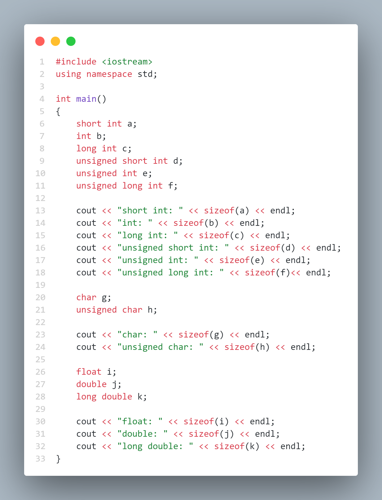
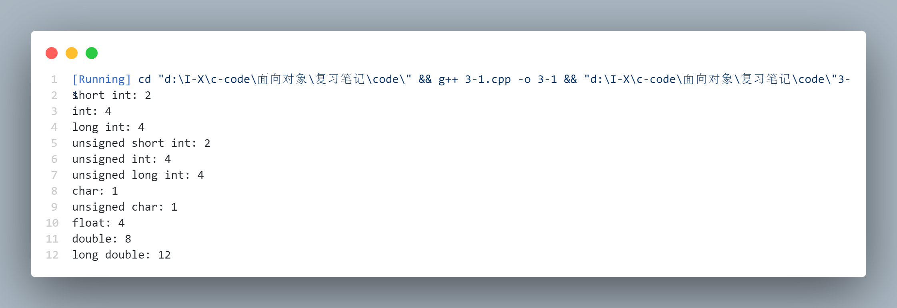
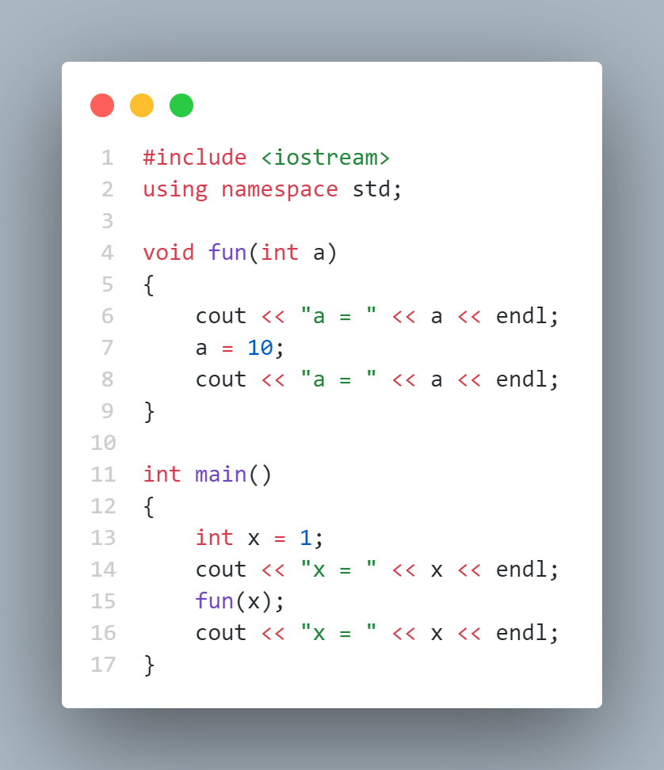
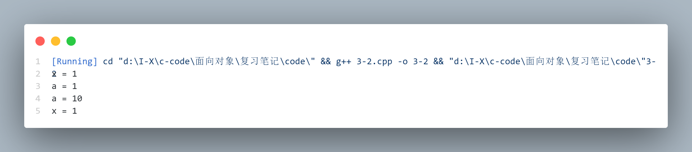
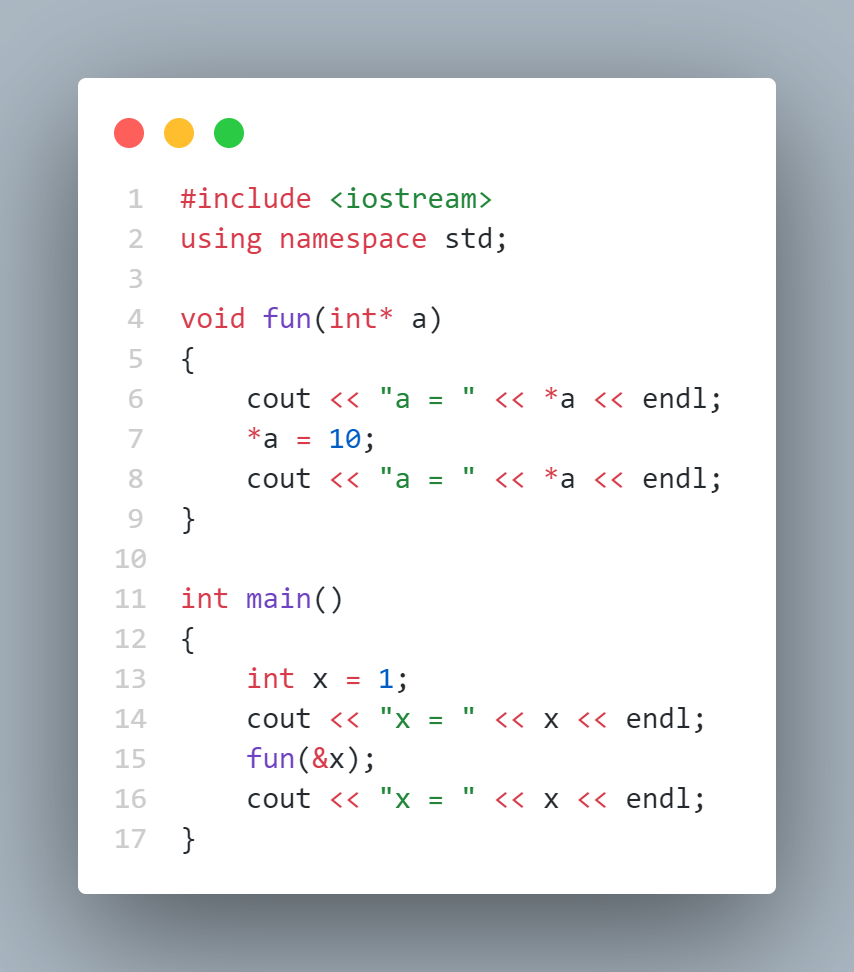
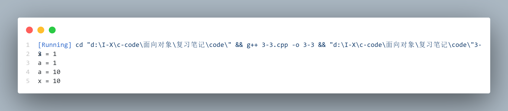
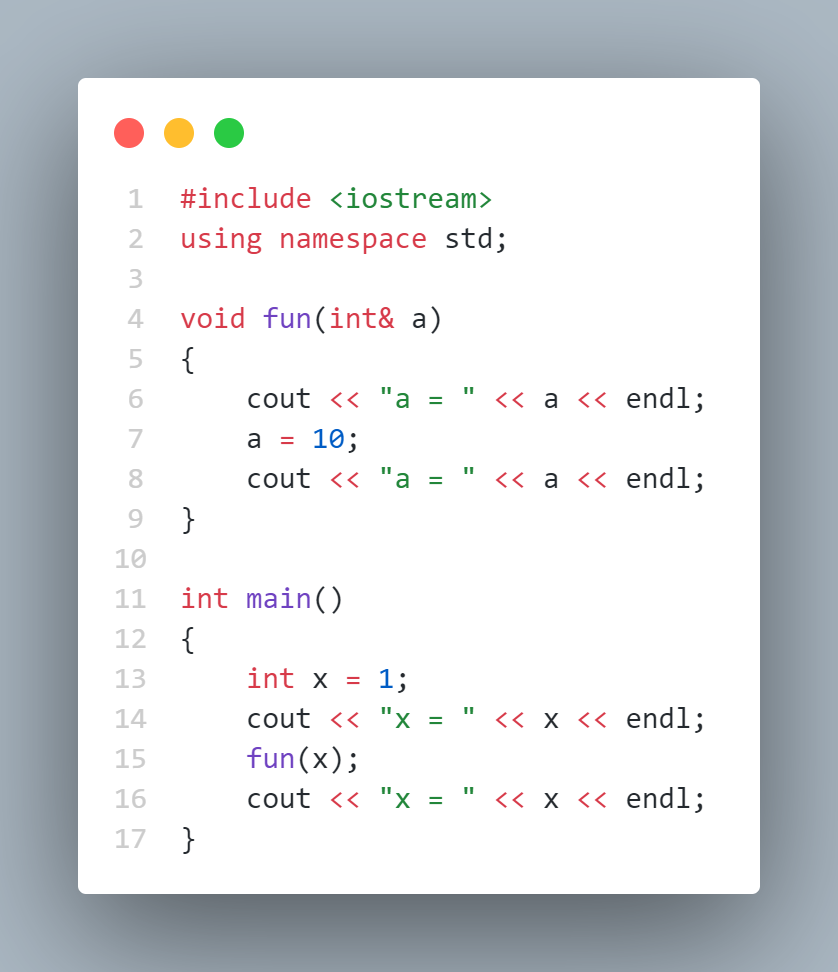
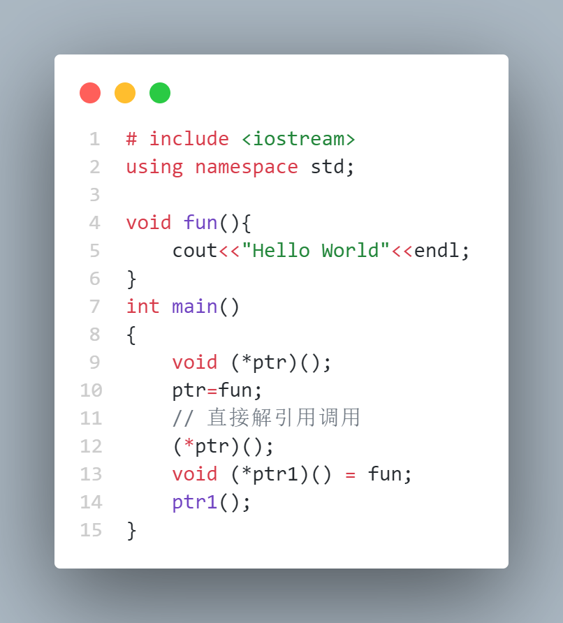
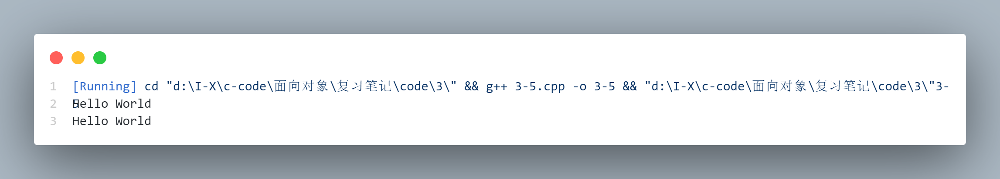

# The C in C++ ( C++ 中的 C )

## Introduction to data types ( 数据类型介绍 )

| 术语中文 | 术语英文 |
|:---:|:---:|
| 数据类型 | data type |
| 说明符 | specifier |
| 指针 | pointer |
| 按值传递 | pass by value |
| 按引用传递 | pass by reference |

### **Specifier ( 说明符 )**

说明符（specifier）用于改变基本内建类型的含义并把它们扩展成一个更大的集合. 有4个说明符：long、short、signed 和 unsigned. 

+ long 和 short 修改数据类型具有的最大值和最小值. 一般的 int 必须至少有 short int 型的大小. 整数类型的大小等级是：short int、int、long int. 

+ 浮点数的大小等级是：float、double和long double. “long float”是不合法的类型, 也没有short浮点数

+ signed 和 unsigned 修饰符告诉编译器怎样使用整数类型和字符的符号位（浮点数总含有一个符号）. unsigned 数不保存符号, 因此有一个多余的位可用, 所以它能存储比 signed 数大一倍的正数. 

    > signed 是默认的, 只有 char 才必须使用 signed

+ char 可以默认为 signed, 也可以不默认为 signed. 通过规定 signed char, 可以强制使用符号位. 

[笔记代码](./code/3/3-1.cpp)：



运行结果：




### **Introduction to pointers ( 指针介绍 )**

指针（pointer）：专门的存放地址的变量类型

```cpp
    int* p;
    // 只有a是指针
    int* a, b, c; 
    int data = 5;
    int* ptr = &data;
    // 通过指针访问变量, 使用地址去修改原先的变量
    *ptr = 10;
```

void 与 指针

如果声明指针是void*, 它意味着任何类型的地址都可以间接引用那个指针（而如果声明int*, 则只能对int型变量的地址间接引用那个指针）

```cpp
    void* vp;
    int a;
    char c;
    float f;
    double d;
    vp = &a;
    vp = &c;
    vp = &f;
    vp = &d;
```

一旦我们间接引用一个void*, 就会丢失关于类型的信息. 这意味着在使用前, 必须转换为正确的类型：

```cpp
    int i = 1;
    void* vp = &i;
    // *vp = 10; -- error
    *((int*)vp) = 10; // 不建议的语法, 应当避免使用void指针
```


### **Modifying the outside object ( 修改外部对象 )**

通常, 向函数传递参数时, 在函数内部生成该参数的一个拷贝 ( copy ), 这称为 pass-by-value

[笔记代码](./code/3/3-2.cpp)：



运行结果：



可以看到, a 是在函数 fun 运行中创建的临时变量, 通过按值传递拷贝得到 x 的值, 然后修改了 a 的值, 但是外部 x 的值没有改变, 因为对 a 的修改作用在临时变量的地址上, 而不是 x 的地址上. 

那么, 如果希望在函数内部修改外部变量的值, 就可以使用指针传入变量地址, 这使得函数能够修改通过对外部变量地址的访问修改其值. 

[笔记代码](./code/3/3-3.cpp)：



运行结果：



### **Introduction to C++ references ( C++ 引用介绍 )**

在 C 和 C++ 中指针的作用基本上是一样的, 但是 C++ 增加了另外一种给函数传递地址的途径. 这就是 pass-by-reference

引用和指针的不同之处在于, 带引用的函数调用比带指针的函数调用在语法构成上更清晰（在某种情况下, 使用引用实质上的确只是语法构成上不同）

> 按引用传递的形式和按值传递几乎一样, 唯一的不同实在函数所调用的参数前需要加上取址符 &. 

[笔记代码](./code/3/3-4.cpp)：



> 运行结果与使用指针相同, 此处不再展示

## Scoping ( 作用域 )

Scoping 规则告诉我们一个变量的有效范围, 它在哪里创建, 在哪里销毁（也就是说, 超出了作用域）. 变量的有效作用域从它的定义点开始, 到和定义变量之前最邻近的开括号配对的第一个闭括号. 也就是说, 作用域由变量所在的最近一对括号确定. 

只有在变量的作用域内, 才能使用它. 作用域可以嵌套, 即在一对大括号里面有其他的大括号对. 嵌套意味着可以在我们所处的作用域内访问外层作用域的一个变量. 

## Specifying storage allocation ( 指定存储分配 )

| 术语中文 | 术语英文 |
|:---:|:---:|
| 指定 | specify |
| 存储分配 | storage allocation |
| 全局变量 | global variable |
| 局部变量 | local variable |
| 自动变量 | automatic variable |
| 寄存器变量 | register variable |
| 块 | block |
| 形参 | formal argument |
| 文件作用域 | file scope |
| 外部连接 | external linkage |
| 内部连接 | internal linkage |


### **Global variables ( 全局变量 )**

全局变量是在所有函数体的外部定义的, 程序的所有部分（甚至其他文件中的代码）都可以使用. 全局变量不受作用域的影响, 总是可用的（也就是说, 全局变量的生命期一直到程序的结束）. 

> 需要注意的是, 在其他文件中调用全局变量时, 需要使用 extern 关键字告诉编译器这个变量已经在别的文件中定义. 

```cpp
    // 1.cpp
    int a;
    void fun();
    int main()
    {
        a = 1;
        cout << a<< endl;
        fun();
        cout << a << endl;
    }
    // 2.cpp
    extern int a;
    void fun(){
        a = 10;
    }
```

### **Local variables ( 局部变量 )**

局部变量出现在一个作用域内, 它们局限于一个函数的. 局部变量经常被称为 automatic variable, 因为它们在进入作用域时自动生成, 离开作用域时自动消失. 关键字 auto 可以显式地说明这个问题, 但是局部变量默认为 auto, 所以没有必要声明为 auto. 

#### Register variables ( 寄存器变量 )

寄存器变量是一种局部变量. 关键字 register 告诉编译器“尽可能快地访问这个变量”. 加快访问速度取决于实现, 但是, 正如名字所暗示的那样, 这经常是通过在寄存器中放置变量来做到的. 这并不能保证将变量放置在寄存器中, 甚至也不能保证提高访问速度. 这只是对编译器的一个暗示. 

使用register变量是有限制的. 不可能得到或计算 register 变量的地址. register 变量只能在一个块中声明（不可能有全局的或静态的 register 变量）. 然而可以在一个函数中（即在参数表中）使用 register 变量作为一个形式参数

一般地, 不应当推测编译器的优化器, 因为它可能比我们做得更好. 因此, 最好避免使用关键字register. 

### **Static ( 静态变量 )**

通常, 函数中定义的局部变量在函数作用域结束时消失. 当再次调用这个函数时, 会重新创建该变量的存储空间, 其值会被重新初始化. 如果想使局部变量的值在程序的整个生命期里仍然存在, 我们可以定义函数的局部变量为 static（静态的）, 并给它一个初始值. static 初始化只在函数第一次调用时执行, 函数调用之间变量的值保持不变. 

相较于全局变量, static 变量的优点是在函数范围之外它是不可用的, 所以它不会被轻易地改变, 这会使错误局部化

当应用 static 于函数名和所有函数外部的变量时, 它的意思是“在文件的外部不可以使用这个名字”. 函数名或变量是局部于文件的；我们说它具有文件作用域（file scope）. 

> 也就是说即便使用 extern, 也不能使用在另一个文件中使用 static 变量

### **Extern ( 外部变量 )**

extern 关键字告诉编译器这个变量在别的文件中定义. 

### **Linkage ( 链接 )**

> 没看明白有的地方

在一个执行程序中, 标识符代表存放变量或被编译过的函数体的存储空间. 连接用连接器所见的方式描述存储空间. 连接方式有两种：内部连接（internal linkage）和外部连接（external linkage）

+ 内部连接意味着只对正被编译的文件创建存储空间. 用内部连接, 别的文件可以使用相同的标识符或全局变量, 连接器不会发现冲突—也就是为每一个标识符创建单独的存储空间. 

    > 在 C 和 C++ 中, 内部连接是由关键字 static 指定的. 

+ 外部连接意味着为所有被编译过的文件创建一片单独的存储空间. 一旦创建存储空间, 连接器必须解决所有对这片存储空间的引用. 

全局变量和函数名有外部连接. 通过用关键字 extern 声明, 可以从其他文件访问这些变量和函数. 

函数之外定义的所有变量（在 C++ 中除了 const ）和函数定义默认为外部连接. 可以使用关键字 static 特地强制它们具有内部连接, 也可以在定义时使用关键字 extern 显式指定标识符具有外部连接. 在 C 中, 不必用 extern 定义变量或函数, 但是在 C++ 中对于 const 有时必须使用. 

调用函数时, 自动（局部）变量只是临时存在于堆栈中. 连接器不知道自动变量, 所
以这些变量没有连接. 

### **Constants ( 常量 )**

C++ 引入了命名常量的概念, 命名常量就像变量一样, 只是它的值不能改变. 修饰符 const 告诉编译器这个名字表示常量. 

在标准 C 和 C++ 中, 可以在参数列表中使用命名常量, 即使列表中的参数是指针或引用（也就是说, 可以获得 const 的地址）. const 就像正常的变量一样有作用域, 所以可以在函数中“隐藏”一个 const, 确保名字不会影响程序的其余部分. 

#### 在 C++ 中, 一个 const 必须有初始值

如果没有其他的线索, 编译器会认为常量值是十进制. 数值47、0和1101都被认为是十进制数. 

常量值前带0被认为是八进制数（基数为8）. 基数为8的数值只能含有数字0～7；编译器标记其他数字为错误. 017是一个合法的八进制数（相当于基数为10的数值15）. 

常量值前带0x被认为是十六进制数（基数为16）. 基数为16的数值只能含有数字0～9和字母a～f或A～F. 0x1fe是一个合法十六进制数（相当于基数为10的数值510）

#### Volatile 变量

限定词const告诉编译器“这是不会改变的”（这就允许编译器执行额外的优化）；而限定词volatile则告诉编译器“不知道何时会改变”, 防止编译器依据变量的稳定性作任何优化. 

## Operators ( 运算符 )

| 术语中文 | 术语英文 |
|:---:|:---:|
| 位运算符 | Bitwise operators |
| 移位运算符 | Shift operators |
| 转换运算符 | Casting  operators |


### **Bitwise operators ( 位运算符 )**

位运算符允许在一个数中处理个别的位（因为浮点数使用一种特殊的内部格式, 所以位运算符只适用于整型 char、int 和 long ）. 位运算符对参数中的相应位做布尔代数运算来产生结果

与( & ) 或 ( | ) 异或 ( ^ ) 非 ( ~ )

| 输入位1 | 运算符 | 输入位2 | 输出 |
|:---:|:---:|:---:|:---:|
| 0 | & | 0 | 0 |
| 0 | & | 1 | 0 |
| 1 | & | 0 | 0 |
| 1 | & | 1 | 1 |
| 0 | \| | 0 | 0 |
| 0 | \| | 1 | 1 |
| 1 | \| | 0 | 1 |
| 1 | \| | 1 | 1 |
| 0 | ^ | 0 | 0 |
| 0 | ^ | 1 | 1 |
| 1 | ^ | 0 | 1 |
| 1 | ^ | 1 | 0 |
| 0 | ~ | 0 | 1 |
| 0 | ~ | 1 | 0 |
| 1 | ~ | 0 | 0 |
| 1 | ~ | 1 | 0 |

### **Shift operators ( 移位运算符 )**

移位运算符也是对位的操纵. 左移位运算符（＜＜）引起运算符左边的操作数向左移动, 移动位数由运算符后面的操作数指定. 右移位运算符（＞＞）引起运算符左边的操作数向右移动, 移动位数由运算符后面的操作数指定. 

通常情况下, 使用位函数的效率非常高, 因为它们被直接翻译成汇编语言语句.

### **Casting operators ( 转换运算符 )**

为了实现转换, 要用括号把所想要转换的数据类型（包括所有的修饰符）括起来放在值的左边. 这个值可以是一个变量、一个常量、由一个表达式产生的值或是一个函数的返回值. 

```cpp
    int i = 10;
    unsigned int ui = (unsigned int)i;
```

转换一般用于变量, 而不用于常量

## Function addresses ( 函数地址 )

| 术语中文 | 术语英文 |
|:---:|:---:|
| 函数地址 | Function address |
| 表格式驱动码 | Table-driven code |

一旦函数被编译并载入计算机中执行, 它就会占用一块内存. 这块内存有一个地址, 因此函数也有地址. 

### **Defining a function pointer ( 定义函数指针 )**

要定义一个指针指向一个无参无返回值的函数, 可以写成：

```cpp
    // 无-指针-函数-无返回值
    void (*funcPtr)(); // 函数指针
    // 函数-返回指针
    void *funcPtr();// 指针函数
```

当看到像这样的一个复杂定义时, 最好的处理方法是从中间开始和向外扩展. “从中间开始”的意思是从变量名开始, 这里是指 funcPtr. “向外扩展”的意思是先注意右边最近的项（在这个例子中没有该项, 以右括号结束）, 然后注意左边（用星号表示的指针）表明这是一个指针, 注意右边（空参数表表示这个函数没有带任何参数）表明时无参函数, 再注意左边（void指示函数没有返回值）. 

**大多数声明都是以右-左-右动作的方式工作的. **

### **Using a function pointer ( 使用函数指针 )**

一旦定义了一个函数指针, 在使用前必须给它赋一个函数的地址. 就像一个数组 arr[10] 的地址是由不带方括号的这个数组的名字 ( arr ) 产生的一样, 函数 func( ) 的地址也是由没有参数列表的函数名 ( func ) 产生的. 

> 也可以使用更加明显的语法 &func( )

[笔记代码](./code/3/3-5.cpp)：



运行结果：



### **Arrays of pointers to functions ( 数组指针函数 )**

我们能够创建的一个更为有趣的结构是指向函数的指针数组. 为了选择一个函数, 只需要使用数组的下标, 然后间接引用这个指针. 

这种方式支持表格式驱动码（table-driven code）的概念；可以根据状态变量（或者状态变量的组合值）去选择被执行函数, 而不用条件语句或 case 语句. 这种设计方式对于经常要从表中添加或删除函数（或者想动态地创建或改变表）十分有用. 
