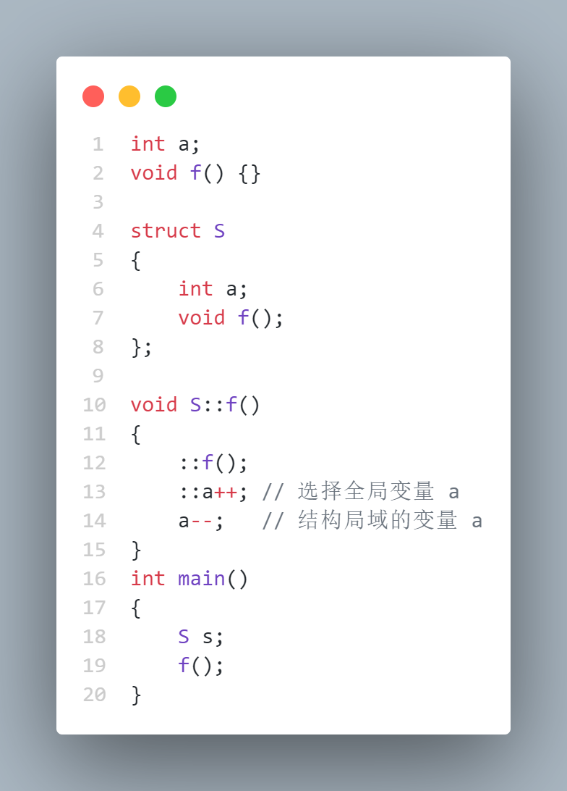
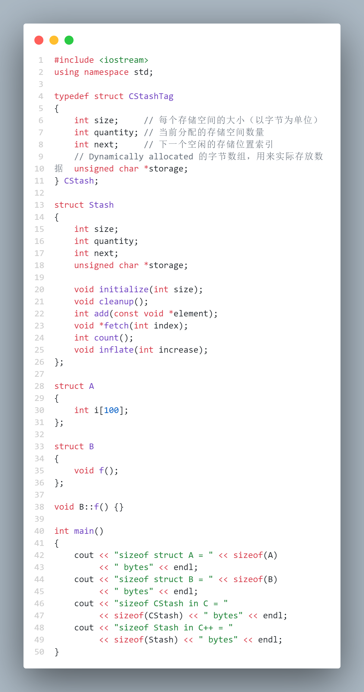
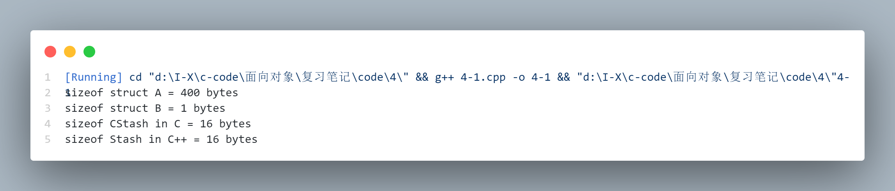

# Data Abstraction ( 数据抽象 )

| 术语中文 | 术语英文 |
|:---:|:---:|
| 提取 | Extract |
| 重新配置和编译 | Reconfigure and recompile |


库是他人已经写好的一些代码，按某种方式包装在一起。通常，最小的包是带有扩展名 ( 如 lib ) 的文件和向编译器声明库中有什么的一个或多个头文件。连接器知道如何在库文件中搜索和 extract 相应的已编译的代码。但是，这只是提供库的一种方法。在跨越多种体系结构的平台 ( 例如 Linux / Unix ) 上，通常，提供库的最明智的方法是使用源代码，这样它就能在新的目标机上被 reconfigured and recompiled。

库是改进生产效率的最重要的方法。C++ 的主要设计目标之一就是使库使用起来更加容易。理解这个因素将使我们对 C++ 设计有一个初步的了解，并因而对如何使用它有更深入的认识


## A tiny C-like library ( 一个简单的 C-like 库 )

| 术语中文 | 术语英文 |
|:---:|:---:|
| 动态分配 | Dynamic allocation |
| 字节数组 | Array of bytes |
| 指明 | Indicate |
| 存储空间 | Storage space |
| 边界 | Boundary |
| 堆 | Heap |
| 内存泄露 | Memory leak |


假设有一个编程工具，当创建时，它的表现像一个数组，但它的长度能在运行时建立。称它为 CStash。虽然它是用 C++ 写的，但是它有 C 语言的风格：

```cpp
    // CLib.h
    // 一个类似于C语言风格的库的头文件

    typedef struct CStashTag {
        int size;        // 每个存储空间的大小（以字节为单位）
        int quantity;    // 当前分配的存储空间数量
        int next;        // 下一个空闲的存储位置索引
        // Dynamically allocated 的字节数组，用来实际存放数据
        unsigned char* storage;
    } CStash;

    void initialize(CStash* s, int size);
    void cleanup(CStash* s);
    int add(CStash* s, const void* element);
    void* fetch(CStash* s, int index);
    int count(CStash* s);
    void inflate(CStash* s, int increase);
```

> storage 指针是一个 unsigned char* 。这是 C 编译器支持的最小的存储单位，尽管在某些机器上它可能与最大的一般大，这依赖于具体实现，但一般占一个字节长。

```cpp
    // CLib.cpp
    // C 风格库示例的实现
    // Declare structure and functions

    #include "CLib.h"
    #include <iostream>
    #include <cassert> 
    using namespace std;

    // 存储扩容时每次增加的元素数量
    const int increment = 100;

    void initialize(CStash* s, int sz) {
        s->size = sz;
        s->quantity = 0;
        s->storage = 0;
        s->next = 0;
    }

    int add(CStash* s, const void* element) {
        if(s->next >= s->quantity) // 空间是否足够？
            inflate(s, increment);
        // 从下一个空位开始复制元素到存储区
        int startBytes = s->next * s->size;
        unsigned char* e = (unsigned char*)element;
        for(int i = 0; i < s->size; i++)
            s->storage[startBytes + i] = e[i];
        s -> next++;         // 更新下一个空位索引
        return(s->next - 1); // 返回元素的索引号
    }

    void* fetch(CStash* s, int index) {
        // Check index boundaries:
        assert(0 <= index);
        if(index >= s->next)
            return 0; // 使用 nullptr 表示越界
        // 生成指向所需元素的指针
        return &(s->storage[index * s->size]);
    }

    int count(CStash* s) {
        return s->next;  // 返回 CStash 中的元素数量
    }

    void inflate(CStash* s, int increase) {
        assert(increase > 0);
        int newQuantity = s->quantity + increase;
        int newBytes = newQuantity * s->size;
        int oldBytes = s->quantity * s->size;
        unsigned char* b = new unsigned char[newBytes];
        for(int i = 0; i < oldBytes; i++)
            b[i] = s->storage[i]; // 复制旧数据到新数组
        delete [](s->storage);    // 释放旧存储空间
        s->storage = b;           // 指向新分配的内存
        s->quantity = newQuantity;
    }

    void cleanup(CStash* s) {
        if(s->storage != 0) {
            cout << "freeing storage" << endl;
            delete []s->storage;
        }
    }

```

initialize ( ) 通过设置内部变量为适当的值。完成对 struct CStash 的必要设置。设置 storage 指针为零，表示不分配初始存储。

add ( ) 函数在 CStash 的下一个可用位置上插入一个元素。首先，它检查是否有可用空间，如果没有，它就用后面介绍的 inflate ( ) 函数扩展存储空间。

fetch ( ) 首先看 index 是否越界，如果没有越界，返回所希望的变量地址，地址采用 index 参数计算。因为 index 指出了相对于 CStash 的偏移元素数，所以必须乘上每个单元拥有的字节数，产生按字节计算的偏移量。当此偏移用于计算使用数组下标的 storage 的下标时，得到的不是地址，而是处于这个地址上的字节。

### **Dynamic storage allocation ( 动态存储分配 )**

我们不可能预先知道一个 CSatsh 需要的最大存储量是多少，所以从 heap中分配由 storage 指向的内存。Heap 是很大的内存块，用以在运行时 allocating 一些小的存储空间。在写程序时，如果还不知道所需内存的大小，就可以使用 heap。

在标准 C 中，动态内存分配函数包括 malloc ( )、calloc ( )、realloc ( ) 和 free ( )。

在 C++ 中，采用更高级的方法，即被集成进这个语言中的动态存储分配，使用关键字 new 和 delete。

inflate ( ) 函数使用 new 为 CStash 得到更大的空间块。在这种情况下，只扩展内存而不缩小它，assert ( ) 保证不把负数传给 inflate ( ) 作为 increase 的值。能够存储的新元素数 ( inflate ( ) 完成后 ) 由计算 newQuantity，再乘以每个元素的字节数得到 newBytes，这是分配的字节数。因此，可以知道从旧的位置拷贝多少字节，oldBytes 用旧的 quantity 计算。

实际的存储分配出现在 new 表达式中，它是包含 new 关键字的表达式 :

```cpp
    new unsigned char[newBytes];
    // new 表达式的一般形式是：
    new Type;  // Type 表示希望在堆上分配的变量的类型
```

new 表达式返回指向所请求的准确类型对象的指针，因此，如果声明 new Type，返回的是指向 Type 的指针。如果声明 new int，返回指向一个 int 的指针。如果声明 new unsigned char 数组，返回的是指向这个数的第一个元素的指针。

> 编译器确保把这个 new 表达式的返回值赋给一个正确类型的指针

当然，任何时候申请内存都有可能失败，例如存储单元用完，正如我们看到的，C++有判断是否内存分配不成功的机制。

数据被拷贝以后，必须释放老的内存块，以便程序的其他部分在需要新内存块时使用。delete 关键字是 new 的对应关键字，任何由 new 分配的内存块必须用 delete 释放。

> 如果忘记了使用 delete，这个内存块就不能用了，这称为 memory leak。泄漏到一定程度，内存就耗尽了

释放数组有特殊的语法形式，也就是必须提醒编译器，注意这是指向对象数组的指针，而不是仅仅指向一个对象的指针。该语法形式是在被释放的指针前面加一对空方括号：

```cpp
    delete []MyArray;
```

当编译时，如果在栈上创建一个变量，那么这个变量的存储单元由编译器自动开辟和释放。编译器准确地知道需要多少存储容量，根据这个变量的活动范围知道这个变量的生命期。而对动态内存分配，编译器不知道需要多少存储单元，不知道它们的生命期，不能自动清除。因此需要使用 delete 手动清除。

## The basic object ( 基本对象 )

| 术语中文 | 术语英文 |
|:---:|:---:|
| 名字冲突 | Name clashes |
| 作用域解析符 | Scope resolution operator |
| 标识 | Identifier |

### **Name clashes ( 名字冲突 )**

在 C 中，使用库的最大的障碍之一是名字冲突 ( name clashes )。对于函数，C 使用**单个名字空间**，当连接器查找一个函数名时，它在一个主表中查找，而且，当编译器编译一个单元时，它只能对带有指定名字的单个函数进行处理工作。

无论哪种情况，都不允许使用包含具有同名函数的两个 C 库。为了解决这个问题，C 库厂商常常会在它们的所有函数名前加上一个独特字符串。所以，initialize ( ) 和 cleanup ( ) 可能变为 CStash_initialize ( ) 和 CStash_cleanup ( )。这是合乎逻辑的，因为它“修饰了”这个 struct 的名字，而该函数以这样的函数名对这个 struct 操作。

现在到了迈向 C++ 第一步的时候。我们知道，struct 内部的标识符不会与全局标识符冲突。而当一些函数在特定 struct 上运算时，为什么不把这一优点扩展到函数名上呢？也就是，为什么不让函数成为 struct 的成员呢？

### ** Convert to C++ ( 转换为 C++ )**

C++ 的第一步正是这样，函数可以放在 struct 内部，作为“成员函数”。CStash 的 C 版本
翻译成 C++ 的 Stash 后是：

```cpp
    // CppLib.h

    struct Stash {
        int size;
        int quantity;
        int next;
        unsigned char* storage;

        void initialize(int size);
        void cleanup();
        int add(const void* element);
        void* fetch(int index);
        int count();
        void inflate(int increase);
    };
```

首先，注意到这里没有 typedef，而是要求程序员创建一个 typedef。C++ 编译器把结构名转变为这个程序的新类型名（就像 int、char、float 和 double 是类型名一样）。

另外，注意到，对应于这个库中的 C 版本中第一个参数已经去掉了。在 C++ 中，不是硬性传递这个结构的地址作为在这个结构上运算的所有函数的第一个参数，而是编译器秘密地做这件事。现在，这些函数的仅有的参数与它们所做的事情有关，而不与这些函数的运算机制有关。

> 我个人的理解是将 self 指针隐式传递给函数，从而避免了函数调用时需要传递 self 参数，参考 python 中写类的方式。

#### Scope resolution operator ( 作用域解析符 )

当正在定义函数时，需要完全指定它是哪一个。为了完成这个指定任务，C++ 有一个新的运算符 ( :: )，即 scope resolution operator ( 这样命名是因为名字现在能在不同的范围内：在全局范围内或在一个struct的范围内 )。例如，如果希望指定 initialize ( ) 属于 Stash，就写  

```cpp
    Stash::initialize ( int size )
```

#### Global scope resolution ( 全局作用域解析 )

编译器默认选择的名字（“最接近”的名字）可能不是我们要用的名字，scope resolution operator 可以避免这种情况。

假设有一个结构，它的局域标识符为 a，但是我们希望在成员函数内选用全局标识符 a。这时，编译器将默认选择局域的另一个标识符，因而必须告诉编译器应该选择哪个标识符。当你要用 scope resolution operator 指定一个全局名字时，在运算符前面不加任何东西。

[笔记代码](./code/4/4-1.cpp)



如果在 S::f ( ) 中没有 scope resolution operator，编译器会默认地选择成员函数的f ( ) 和 a。

#### This 关键字 

在成员函数内部，成员照常使用。这样，不写 s -> size = sz，而写 size = sz。这就消除了多余的 s ->，它对我们所做的任何事情不能添加任何含义。当然，C++ 编译器必须为我们做这些事情。

```cpp
    // C 中 s 是指向结构的指针 CStash*;
    s -> size = sz;
    // C++ 中操作
    size = sz;
    this->size = sz;
```

### **What's an object? ( 对象是什么？ )**


**把函数放进结构中是从 C 到 C++ 的根本改变**。在C中， struct 是数据的凝聚，它将数据捆绑在一起，使得我们可以将它们看做一个包。但这除了能使编程方便之外，别无其他。对这些结构进行操作的函数可以在别处。

然而将函数也放在这个包内，结构就变成了新的创造物了，它既能描写属性，又能描述行为，这就形成了对象的概念。对象是一个独立的捆绑的实体，有自己的记忆和活动。

在 C++ 中，对象就是变量，它的最纯正的定义是“一块存储区” ( 更明确的说法是，“对象必须有惟一的 identifier ”，在 C++ 中是一个惟一的地址 )。它是一块空间，在这里能存放数据，而且还隐含着有对这些数据进行处理的操作。

## Object details ( 对象细节 )

|术语中文 | 术语英文 |
|:---:|:---:|
| 封装 | Encapsulation |
| 抽象数据类型 | Abstract data type |

### **Abstract data typing ( 抽象数据类型 )**

将数据连同函数捆绑在一起的能力可以用于创建新的数据类型。这常常被称为 encapsulation.

Stash 的定义创建了一个新数据类型，可以 add ( ) 、fetch ( ) 和 inflate ( )。由说明 Stash s 创建一个 Stash 就像由说明 float f 创建一个 float 一样。一个 Stash 也有属性和行为，甚至它的活动就像一个实数—一个内建的数据类型。称 Stash 为抽象数据类型 ( abstract data type ).

object.memberFunction（arglist）是对一个对象“调用一个成员函数”。而在面向对象的用法中，也称之为“向一个对象发送消息”。这样，对于 Stash s，语句 s.add（＆i）“发送消息给s”，也就是说，“将它与自己add（）”。

事实上，面向对象编程可以总结为一句话，“向对象发送消息”。

### **The size of an object ( 对象的大小 )**

[笔记代码](./code/4/4-2.cpp)



运行结果：



第一个打印语句产生的结果是 400，因为每个 int 占 4 个字节。

struct B 是没有数据成员的 struct。在 C 中，这是不合法的，但在 C++ 中，以这种选择方式创建一个 struct，惟一的目的就是划定函数名的范围，所以这是允许的。

第二个打印语句产生的结果是一个非零值。在该语言的较早的版本中，这个长度是零，但是，当创建这样的对象时出现了笨拙的情况：它们与紧跟着它们创建的对象有相同的地址，没有区别。对象的基本规则之一是每个对象必须有一个惟一的地址，因此，无数据成员的结构总应当有最小的非零长度。

最后两个 sizeof 语句表明在 C++ 中的结构长度与 C 中等价版本的长度相同。C++ 尽力不增加任何不必要的开销。

## Header file etiquette ( 头文件用法 ) 

| 术语中文 | 术语英文 |
|:---:|:---:|
| 头文件 | Header file |
| 预处理器 | Preprocessor |
| 指令 | Directive |
| 宏 | Macro |

一般来说，我们希望将接口（声明）和实现（成员函数的定义）隔离开来，这使得实现能在不需要重新编译整个系统的情况下可以改变。最后，将这个新类型的声明放到头文件中。

用 C++ 建造大项目的最好的方法是采用库，收集相关的函数到同一个对象模块或库中，并且使用同一个头文件存放所有这些函数的声明。在 C 中，鼓励使用函数库，而在 C++ 中，这是一项制度

### **Importance of header files ( 头文件的重要性 )**

将所有的函数声明都放在一个头文件中，并且将这个头文件包含在使用这些函数和定义这些函数的任何文件中，就能确保在整个系统中声明的一致性。通过将这个头文件包含在定义文件中，还可以确保声明和定义匹配。

头文件是我们和我们的库的用户之间的合约。这份合约描述了我们的数据结构，为函数调用规定了参数和返回值。它说，“这里是对我的库做什么的描述。”用户需要其中一些信息以开发应用程序，编译器需要所有这些信息以生成正确的代码。

我们必须认识到为了正确地组织代码和编写有效的头文件，需要考虑几个具体问题。

+ #### 第一个问题涉及应当放什么到头文件中。

    基本的原则是“只限于声明”，即只限于对编译器的信息，不涉及通过生成代码或创建变量而分配存储的任何信息。这是因为头文件一般会包含在项目的几个翻译单元中，如果一个标识符在多于一处被分配存储，那么连接器就报告多次定义错误

    > 这是 C++ 的一次定义规则：可以对事物声明任意多次，但是对于每个事物只能实际定义一次

    这条规则不是呆板的。如果在头文件中定义了一个“文件静态”变量（仅在一个文件内可视的变量），那么在整个项目中会有该数据的多个实例，但连接器不会冲突。基本上，我们不希望做任何会引起连接时歧义性的事情

+ #### 第二个问题是：如果把一个struct声明放在一个头文件中，就有可能在一个编译程序中多次包含这个头文件。

    输入输出流就是一个很好的例子。每次一个 struct 做 I / O 都可能包含一个输入输出流文件。如果我们正在开发的 cpp 文件使用多种 struct ( 典型的是每种包含一个头文件 )，这样就有多次包含 <iostream> 和重声明输入输出流的危险。

    C 和 C++ 都允许重声明函数，只要两个声明匹配即可，但是两者都不允许重声明结构。在 C++ 中，这条规则是特别重要的，因为如果编译器允许重声明一个结构而且这两个声明不同，那么应当使用哪一个声明呢？

    重声明在 C++ 中出现了问题，因为每个数据类型（带函数的结构）一般有它自己的头文件，如果想创造另一个数据类型（它使用第一个数据类型），则我们必须将第一个数据类型的头文件包含在这另一个数据类型中。在我们项目的任何 cpp 文件中，很可能包含几个已经包含了这个相同的头文件的文件。在一次编译过程中，编译器可能会多次看到这个相同的头文件。
    
    除非特别处理，否则编译器将发现结构的重声明，并报告编译时错误。为了解决这个问题，需要知道更多的预处理器的知识.

    > 为了防止多次头文件包含引起的错误，需要在头文件中用预处理器建立一些智能功能 ( 标准C++头文件中 <iostream> 等已经具有这样的“智能”)。

### **The preprocessor directives (#define, #ifdef, and #endif) ( 预处理器指令 )**

预处理器指示 #define 可以用来创建编译时标记。

你有两种选择:

```cpp
    // 你可以告诉预处理器这个标记被定义，但不指定特定的值
    #define FLAG
    // 或者给它一个值（这是典型的定义常数的C方法）
    #define PI 3.14159
    // 无论哪种情况，预处理器都能测试该标记，检查它是否已经被定义
    #ifdef FLAG   // 这将得到一个真值
    // #ifdef 后面的代码将包含在发送给编译器的包中
    // 当预处理器遇到语句，包含终止
    #endif // FLAG
```

#define 的反意是 #undef（“un-define”的简写），它将使得使用相同变量的 #ifdef 语句得
到假值。#undef 还引起预处理器停止 using a macro。#ifdef 的反意是 #ifndef，如果标记还没有定义，它得到真值。

### **A standard for header files ( 头文件的标准 )**

```cpp
    #ifndef HEADER_FLAG
    #define HEADER_FLAG
    // Type declaration here...
    #endif // HEADER_FLAG
```

HEADER_FLAG 可以是任何惟一的名字，但沿用的可靠标准是大写这个头文件的名字并且用下划线替换句点

防止多次包含的这些预处理器语句常常称为包含守卫 ( include guard )。

### **Namespaces in headers ( 头文件中的命名空间 )**

**简言之，不要在头文件中放置使用指令**。


我们将会注意到，在几乎所有cpp文件中都有 using directive 描述，通常的形式如下：

```cpp
    using namespace std;
```

因为std是环绕整个标准C++库的名字空间，所以这个特定的使用指令允许不用限定方式使用标准C++库中的名字。但是，在头文件中是决不会看到使用指令的（至少，不在一个作用域之外）。

原因是，这样的使用指令去除了对这个特定名字空间的保护，并且这个结果一直持续到当前编译单元结束。如果将一个使用指令放在一个头文件中（在一个范围之外），这就意味着“名字空间保护”将在包含这个头文件的任何文件中消失，这些文件常常是其他的头文件。这样，如果将使用指令放在头文件中，将很容易最终实际上在各处“关闭”名字空间，因此不能体现名字空间的好处。


