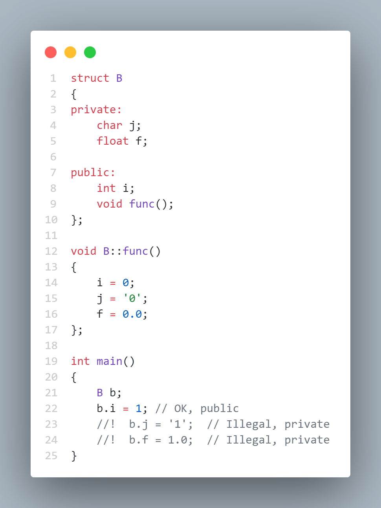
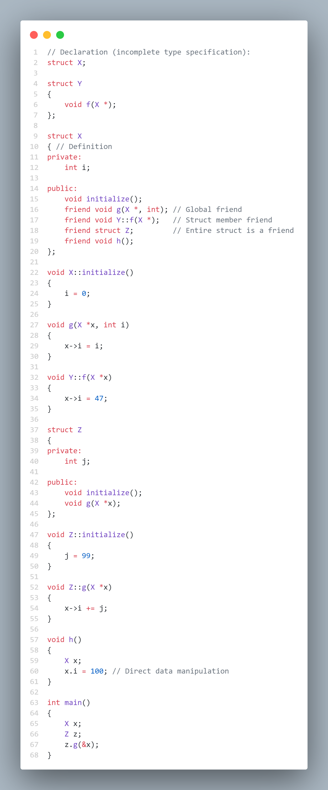
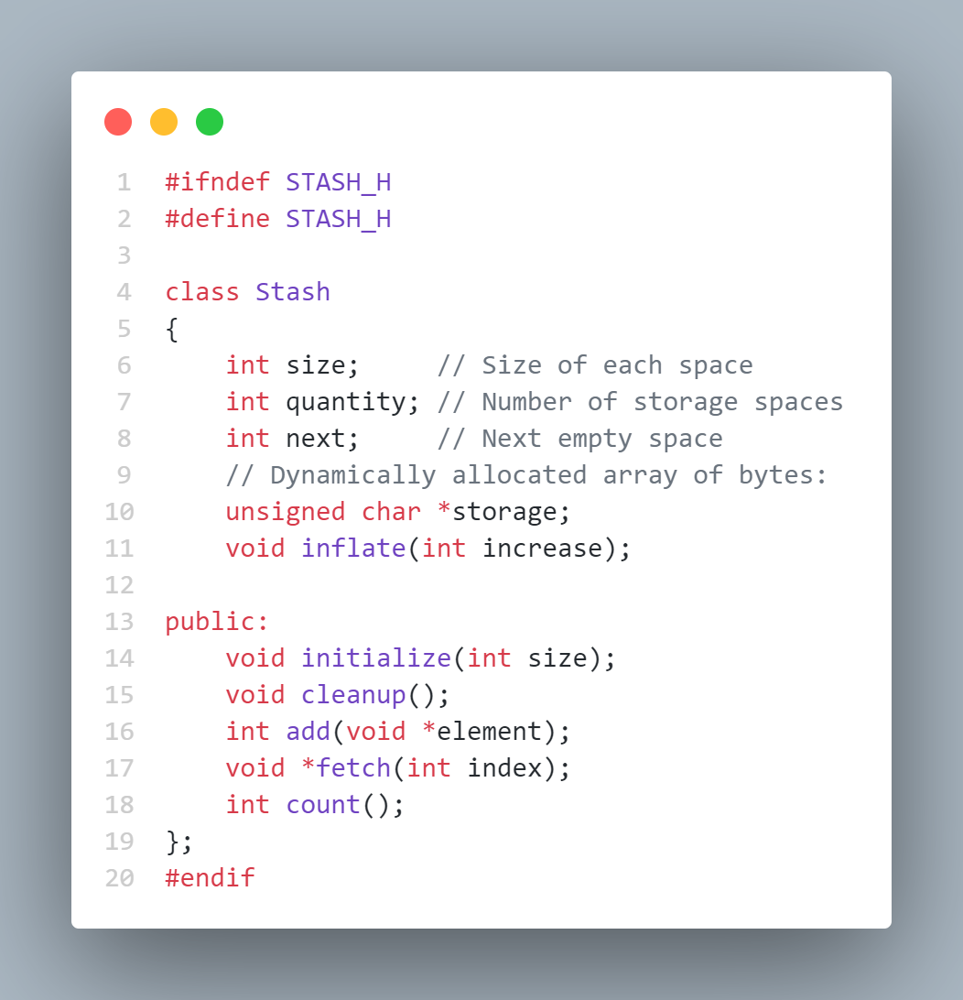
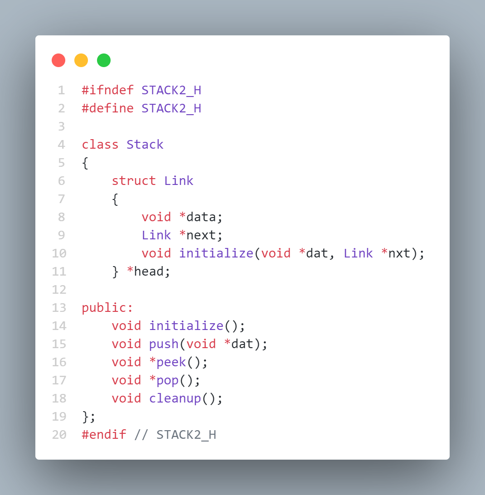

#  Hiding the Implementation ( 隐藏实现 )

> C++ 的安全与控制

## Setting limits ( 设置限制 )

在 C 语言中, struct 同其他数据结构一样, 没有任何规则, 客户程序员可以在 struct 中做他们想做的任何事情, 没有什么途径来强制任何特殊的行为. 比如, 即使已经看到了第 4 章中提到的 initialize（）函数和 cleanup（）函数的重要性, 但客户程序员有权决定是否调用它们（我们将在下一章看到更好的方法）. 再比如, 我们可能不愿意让客户程序员去直接操纵 struct 中的某些成员, 但在 C 语言中没有任何方法可以阻止客户程序员这样做. 

需要控制对结构成员的访问有两个理由：

+ 一是让客户程序员远离一些他们不需要使用的工具, 这些工具对数据类型内部的处理来说是必需的, 但对客户程序员解决特定问题的接口却不是必须的. 这实际上是为客户程序员提供了方便, 因为他们可以很容易地知道, 对他们来说什么是重要的, 什么是可以忽略的. 

+ 二是允许库的设计者改变 struct 的内部实现, 而不必担心会对客户程序员产生影响. 在上一章的 Stack 例子中, 我们想以大块的方式来分配存储空间以提高速度, 而不是在每次增加元素时调用 malloc（）函数来重新分配内存. 如果这些库的接口部分与实现部分是清楚地分离并保护的, 那么就能达到上述目的并且只需要让客户程序员重新连接一遍就可以了. 

> 和这学期一起学的数据的访问控制有异曲同工之妙, 把权限授予的功能集成到语言中, 通过关键字标记来控制访问. 

## C++ access control ( C++ 访问控制 )

| 术语中文 | 术语英文 |
|:---:|:---:|
| 访问说明符 | Access specifier |
| 访问控制 | Access control |

C++ 引进了三个新的关键字, 用于在结构中设置边界：public、private 和 protected. 这些 access specifier 只在结构声明中, 它们可以改变跟在它们之后的所有声明的边界. **无论什么时候使用 access specifier, 后面必须加一个冒号. **

> 对 access specifier 的顺序没有特别的要求, 它们可以出现不止一次, 可以影响在它们之后和下一个访问说明符之前声明的所有成员

+ public 意味着在其后声明的所有成员可以被所有的人访问. public 成员就如同一般的 struct 成员. 

+ private ：除了该类型的创建者和该类型的内部成员函数之外, 任何人都不能访问这些定义

    [笔记代码](./code/5/5-1.cpp)

    

    函数 func ( ) 可以访问 B 的所有成员 ( 因为 func ( ) 是 B 的成员, 所以自动获得访问的权限 ), 但一般的全局函数如 main ( ) 却不能访问, 当然其他结构的成员函数同样也不能访问. 只有那些在结构声明（“合约”）中明确声明的函数才能访问这些 private 成员. 

+ protected ：与 private 基本相似, 但是可以被 inheriting class 访问 ( 在[第 14 章](.14.md)具体讨论 )

## Friends ( 友元 )

| 术语中文 | 术语英文 |
|:---:|:---:|
| 友元 | Friend |
| 不完全类型说明 | Incomplete type specification |
| 嵌套 | Nested |

如果我们希望显式地允许不属于当前结构的一个成员函数, 访问当前结构中的数据, 那该怎么办呢？

我们可以在该结构内部声明这个函数为 friend . 注意, 一个 friend 必须在希望被访问的结构内声明. 编译器从结构的声明以理解这个数据类型的大小、行为等方面的所有规则, 有一条规则在任何关系中都很重要, 那就是“谁可以访问我的私有实现部分”. 

类控制着哪些代码可以访问它的成员. 如果不是一个 friend 的话, 程序员没有办法从类外“破门而入”, 他不能声明一个新类, 然后说 " 嘿, 我是 class Bob 的 friend ", 不能指望这样就可以访问类 Bob 的 private 成员和 protected 成员. 

> 这么啰嗦一大截就是说我们要在定义类的时候就声明他有哪些 friend

程序员可以把一个全局函数声明为 friend, 也可以把另一个结构中的成员函数甚至整个结构都声明为 friend

[笔记代码](./code/5/5-2.cpp)



struct Y有一个成员函数f（）, 它将修改X类型的对象. 这里有一个难题, 因为 C++ 的编译器要求在引用任一变量之前必须先声明, 所以 struct Y 必须在它的成员 Y：f（X*）被声明为 struct X 的一个友元之前声明, 但要声明 Y：f（X*）, 又必须先声明 struct X

> 这体现出声明与实现分离的好处, 这样的设计明显地让相互依赖的类得以使用, 能够建立更加复杂系统 

解决的办法：注意到 Y：f（X*）引用了一个 X 对象的 address. 这一点很关键, 因为编译器知道如何传递一个地址, 这一地址具有固定的大小, 不管被传递的是什么对象, 即使它还没有完全知道这种对象类型的大小. 

> 然而, 如果试图传递整个对象, 编译器就必须知道X的全部定义以确定它的大小以及如何传递, 这就使得程序员无法去声明一个类似于 Y：g（X）的函数. 

通过传递 X 的地址, 编译器允许程序员在声明 Y：f（X*）之前做一个 X 的 incomplete type specification. 这一点是用如下的声明时完成的:

```cpp
    // 该声明仅仅是告诉编译器, 有一个叫 X 的 struct
    struct X;
```

### **Nested friends ( 嵌套友元 )**

嵌套的结构并不能自动获得访问 private 成员的权限. 要获得访问私有成员的权限, 必须遵守特定的规则：首先声明（而不定义）一个嵌套的结构, 然后声明它是全局范围使用的一个 friend, 最后定义这个结构. 结构的定义必须与 friend 声明分开, 否则编译器将不把它看做成员. 

举个例子：

```cpp
    // 外部结构
    struct X {
    public:
        friend struct Y;
    };
    struct Y {
        // 具体实现
    };

    // 嵌套结构
    struct X {
    public:
        struct Y;
        friend struct Y;
        struct Y {  
            // 具体实现
        };
    };
```

> 这一点应该与 friend 关键字的实现有关, 如果被声明为 friend, 就意味着它不是这个类的成员, 因此需要先将其嵌套在结构中再用 friend 关键字修饰. 

### **Is it pure? ( C++ 是纯面向对象的吗 )**

这种类定义提供了有关权限的信息, 通过查看该类可以知道哪些函数可以改变该类的私有部分. 如果一个函数被声明为 friend, 就意味着它不是这个类的成员函数, 却可以修改该类的私有成员, 而且必须被列在该类的定义当中, 因此可以认为它是一个特权函数. 

C++ 不是完全的面向对象语言, 而只是一个混合产品. 增加 friend 关键字就是为了用来解决一些实际问题. 

## Object layout ( 对象布局 )

分析 struct 的对象布局, 也就是各个变量放在分配给对象的内存的什么位置？如果 C++ 编译器改变了 C struct 中的布局, 那么在任何 C 语言代码中使用 struct 中变量的位置信息在 C++ 中就会出错. 

当开始使用访问说明符时, 我们就已经完全进入了 C++ 的领地, 情况开始有所改变. 在一个特定的“访问块”（被访问说明符限定的一组声明）内, 这些变量在内存中肯定是连续存放的, 这和在C语言中一样, 然而这些“访问块”本身可以不按声明的顺序在对象中出现. 

虽然编译器通常都是按访问块出现的顺序给它们分配内存, 但并不是一定要这样, 因为特定机器的体系结构和操作环境可对 private 成员和 protected 成员提供明确的支持, 将其放在特定的内存位置上. C++ 语言的访问说明符并不想限制这种长处. 

访问说明符是结构的一部分, 它们并不影响从这个结构创建的对象. 程序开始运行之前, 所有的访问说明信息都消失了. 访问说明信息通常是在编译期间消失的. 在程序运行期间, 对象变成了一个存储区域.

> 一般说来, 在编写程序时, 依赖特定实现的任何东西都是不合适的. 如确有必要, 这些特定实现部分应封装在一个结构之内, 这样当环境改变时, 只需修改一个地方就行了. 

## The class ( 类 )

| 术语中文 | 术语英文 |
|:---:|:---:|
| 类 | Class |
| 封装 | Encapsulation |
| 嵌套 | Nested |
| 类接口的健壮性 | Robustness of the class interface |

访问控制通常是指实现的隐藏（implementation hiding）. 将函数包含到一个结构内 ( 常称为Encapsulation ) 来产生一种带数据和操作的数据类型, 由访问控制在该数据类型之内确定边界. 

这样做的原因有两个：首先是决定哪些客户程序员可以用, 哪些客户程序员不能用. 我们可以建立结构内部的机制, 而不必担心客户程序员会把内部的数据机制当做他们可使用的接口的一部分来访问. 

这就直接导出了第二个原因, 那就是将具体实现与接口分离开来. 如果该结构被用在一系列的程序中, 而客户程序员只能对 public 的接口发送消息, 这样就可以改变所有声明为 private 的成员而不必去修改客户程序员的代码. 

在 C++ 中使用的 class 逐渐变成了一个非必要的关键字. 它和 struct 的每个方面都是一样的, 除了 **class 中的成员默认为 private**, 而 struct 中的成员默认为 public. 

许多人喜欢用一种更像 struct 的风格去创建一个类, 因为可以通过不顾及类的“默认为private”的行为, 而使用首选为 public 的原则. 之所以这样做, 是因为这样可以让读者首先更清楚地看到他们所要关心的成员, 然后可以忽略所有声明为 private 的成员. 事实上, 所有其他成员都必须在类中声明的惟一原因是让编译器知道对象有多大, 以便为它们分配合适的存储空间, 并保证它们的一致性. 

> 废话一堆, 都给我好好写 public 和 private !

### **Modifying Stash to use access control ( 用访问控制来修改 Stash )**

[笔记代码](./code/5/stash.h)



inflate ( ) 函数声明为 private, 它只被 add ( ) 函数调用, 属于内部实现部分, 不属于接口部分 ( 阻止了不当的访问 ). 这就意味着以后可以调整这些实现的细节, 使用不同的系统来管理内存. 

### **Modifying Stack to use access control ( 用访问控制来修改 Stack )**

[笔记代码](./code/5/stack.h)



现在 Nested 的数据结构是 private. 这样做的好处是可以确保客户程序员既看不到, 也不依赖于 Stack 的内部表示, 惟一改动了的地方是 robustness of the class interface.

> 隐藏实现, 提供接口, 工具人

## Handle classes ( 句柄类 )

| 术语中文 | 术语英文 |
|:---:|:---:|
| 句柄类 | Handle class |
| 易碎的基类问题 | Fragile base-class problem |
| 柴郡猫技术 | Cheshire cat |


在我们的编程环境中, 当一个文件被修改, 或它所依赖的头文件被修改时, 项目管理员需要重复编译该文件. 这意味着程序员无论何时修改了一个类, 无论修改的是公共的接口部分, 还是私有成员的声明部分, 他都必须再次编译包含头文件的所有文件. 这就是通常所说的易碎的基类问题 ( fragile base-class problem ).

对于一个大的项目而言, 在开发初期这可能非常难以处理, 因为内部实现部分可能需要经常改动. 如果这个项目非常大, 用于编译的时间过多可能妨碍项目的快速转型. 解决这个问题的技术有时称为句柄类（handle class）或称为“Cheshire cat”

> 我个人感觉这和 Jetpack Compose 的架构设计类似, 类似于声明式的编程

在这学期的第一次作业中也要求使用了这个技术, 这是当时查资料找到的信息: 

>柴郡猫技术：C++ 中的“柴郡猫技术” ( Cheshire Cat Idiom ), 又称为 PIMPL ( Pointer to IMPLementation ) , Opaque Pointer 等, 是一种在类中只定义接口, 而**将私有数据成员封装在另一个实现类**中的惯用法. 该方法主要是为了隐藏类的数据以及减轻编译时的压力. 使用 PIMPL 需要在堆空间上分配和释放内存, 内存开销增加, 同时也需要更多的间接指针跳转, 因此有一些副作用. 

>虽然如此, PIMPL 仍然是一种实现数据隐藏、减少编译时间的有效方法. 除非会引起显著的程序性能下降, 推荐使用 PIMPL 进行设计. 

[笔记代码文件夹](./code/5/5-3)

> 简言之, 句柄类就是将嵌套类 ( 结构 ) 的实现封装到实现文件中, 这样巧妙的将头文件中基类的变更转移到实现文件的变更中,只对变更文件进行重新编译即可

```cpp
    #ifndef HANDLE_H
    #define HANDLE_H

    class Handle {
        struct Cheshire; // Class declaration only
        Cheshire* smile;
    public:
        void initialize();
        void cleanup();
        int read();
        void change(int);
    };
    #endif 

    // 实现文件中
    struct Handle::Cheshire {
        int i;
        // 其他成员
    };
```