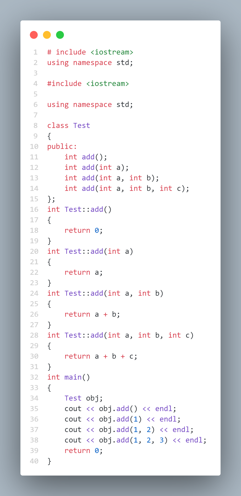
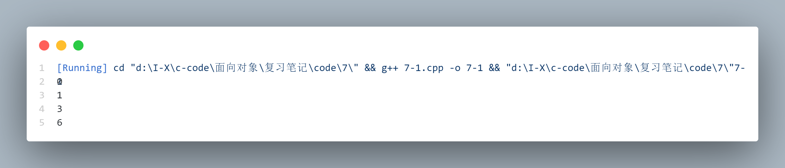

# Function Overloading & Default Arguments ( 函数重载与默认参数 )

通常，自然语言中同一个词可以代表多种不同的含义，具体含义要**依赖上下文**来确定。这就是所谓的一词多义---该词被 **Overload** 了

> 省流: 同名不同参就是函数重载 Overload, 这里主要指参数类型

如果我们想打印三种不同类型的数据：int、char 和 float，通常不得不创建三个不同的函数名，如 print_int ( )、print_char( ) 和 print_float ( )，这些既增加了我们的编程工作量，也给读者理解程序增加了困难

在 C++ 中，还有另外一个因素会使函数名重载：构造函数。因为构造函数的名字预先由类的名字确定，所以看上去只能有惟一一个构造函数名。但如果我们想用多种方法来创建一个对象时该怎么办呢？例如假设创建一个类，这个类可以用标准的方法初始化自身，也可以通过从文件中读取信息来初始化，我们需要两个构造函数，一个不带参数（默认构造函数），另一个以一个字符串作为参数，这个字符串是初始化对象的文件的名字。两个都是构造函数，所以它们必须有相同的名字：类名。因此，函数重载对于允许函数同名是必不可少的。在这种情况下，构造函数是与不同的参数类型一起使用的. 

> 人话: 参数个数不同也行

C++ 中有一个很通用的特征叫做默认参数 ( default argument )。默认参数就是在用户调用一个函数时没有指定参数值而由编译器插入参数值的参数。因此, f ( “hello” )、f ( “hi”，1 ) 和 f( “howdy”，2，‘c’ ) 可以用来调用同一个函数。它们也可能用来调用三个已重载的函数，但当参数列表相同时，我们通常希望调用同一个函数来完成相同的操作.


## More name decoration ( 名字修饰 )

| 术语中文 | 术语英文 |
|:---:|:---:|
| 函数重载 | Function overloading |
| 编译器 | Compiler |
| 类型安全连接 | Type-safe linkage |


之前讲到说编译器会用修饰符来区分同名函数, 比如全局函数和不同类的成员函数, 其实除了这几个之外, compilers 还会用函数的参数列表来修饰函数名, 来分辨函数重载. 

### ~~Overloading on return values ( 根据返回值进行函数重载 )~~

读了上面的介绍，我们自然会问：“为什么只能通过范围和参数来重载，为什么不能通过返回值呢？”乍一听，这似乎完全可行，而且还用返回值修饰了内部函数名，然后就可以用返回值重载了

当编译器能从上下文中惟一确定函数的意思时，如

```cpp
    int x = f()；
```

这当然没有问题。然而，在 C 中，总是可以调用一个函数但忽略它的返回值，即调用了函数的副作用 ( side effect )，在这种情况下，编译器如何知道调用哪个函数呢？更糟的是，读者怎么知道哪个函数会被调用呢？仅仅靠返回值来重载函数实在过于模糊了，所以在 C++ 中**禁止**这样做. 

### **Type-safe linkage ( 类型安全连接 )**

对名字修饰还可以带来一个额外的好处。在C中，如果用户错误地声明了一个函数，或者更糟糕地，一个函数还没声明就调用了，而编译器则按函数被调用的方式去推断函数的声明。这是一个特别严重的问题。有时这种函数声明是正确的，但如果不正确，就会成为一个很难发现的错误。

在 C++ 中，所有的函数在被使用前都必须事先声明，因此出现上述情况的机会大大减少了。编译器不会自动添加函数声明，所以我们应该包含一个合适的头文件。然而，假如由于某种原因还是错误地声明了一个函数，可能是通过自己手工声明，也可能是包含了一个错误的头文件 ( 也许是一个过期的版本 )，名字修饰会给我们提供一个安全网，这也就是人们常说的type-safe linkage. 

> 没看明白书上的例子, 但是我觉得很难出现那样的错误

## Overloading example ( 函数重载例子 )

> 这是参数数目不同的重载, 类型的重载可以考虑用 void add (***) 来计算不同类型的和

[笔记代码](./code/7/7-1.cpp)



运行结果:



## Default arguments ( 默认参数 )

| 术语中文 | 术语英文 |
|:---:|:---:|
| 默认参数 | Default argument |
| 占位符参数 | Placeholder argument |

> 实际上是对非必要函数重载 ( 可针对同类问题泛化, 只改变参数个数 ) 的一个优化策略, 减少代码量

我们可以看到, 上述代码中的函数其实没什么不同

```cpp
    int add(int a);
    int add(int a, int b);
    // 两者相比, 唯一的区别就是第二个函数多了一个参数
    // 而对第一个函数来说, 这个参数可以当作 0 处理
```

也就是说, 其实这可以用一行代码来完成

```cpp
    // 这样只需要一个函数即可
    int add(int a, int b = 0, int c = 0, int d = 0);
```

在使用默认参数时必须记住两条规则:

> 默认参数只能放在函数声明中，通常在一个头文件中。编译器必须在使用该函数之前
知道默认值

+ 只有参数列表的后部参数才是可默认的，也就是说，不可以在一个默认参数后面又跟一个非默认的参数。

+ 一旦在一个函数调用中开始使用默认参数，那么这个参数后面的所有参数都必须是默认的

### **Placeholder arguments ( 占位符参数 )**

函数声明时，参数可以没有标识符，当这些不带标识符的参数用做默认参数时，可以这样声明：

```cpp
    int add(int a, int = 0, int = 0, int = 0);
```

在C++中，在函数定义时，并不一定需要标识符，如:

```cpp
    int add(int a, int, int c, int d) { 
        // 实现部分
    }
```

在函数体中，a , c 和 d 可以被引用，但中间的这个参数值则不行，因为它没有名字。调用还必须为这个 placeholder 提供一个值，有 add ( 1 ) 或 add ( 1, 2, 3)。

这种语法允许把一个参数用做占位符而不去用它, 其目的在于以后可以修改函数定义而不需要修改所有的函数调用。

当然，用一个有名字的参数也能达到同样的目的，但如果定义的这个参数在函数体内没有使用它，多数编译器会给出一条警告信息，并认为犯了一个逻辑错误。用这种没有名字的参数，我们就可以防止这种警告产生。

更重要的是，如果开始用了一个函数参数，而后来发现不需要用它，可以将它去掉而不会产生警告错误，而且不需要改动那些调用该函数以前版本的程序代码.