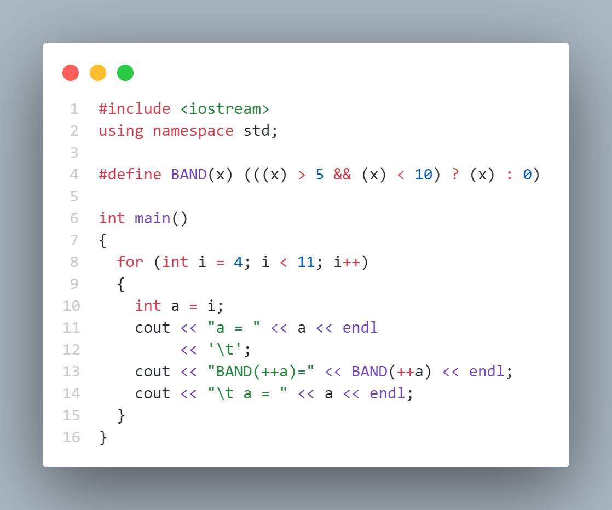
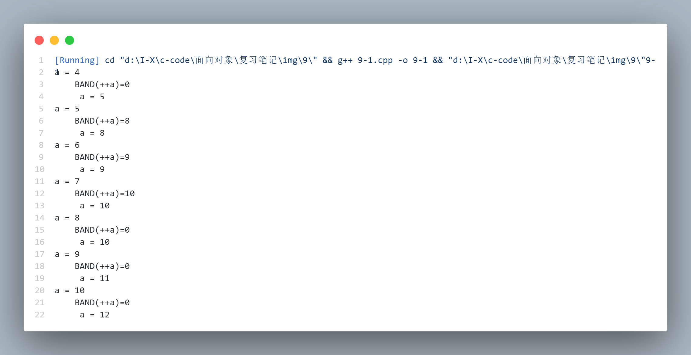
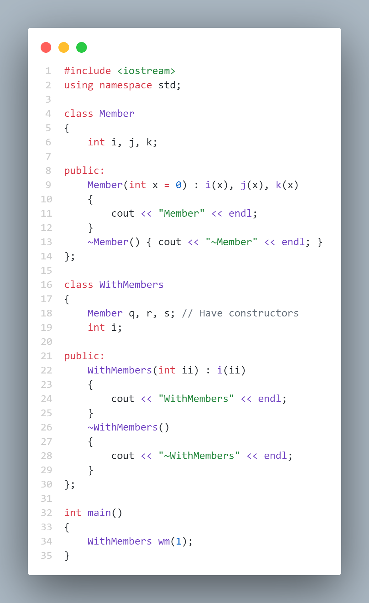
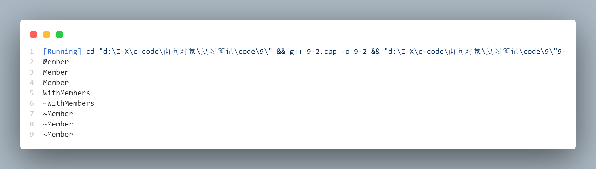

# Inline Functions ( 内联函数 )

在 C 中，保持效率的一个方法是使用 macro。宏的实现是用预处理器而不是编译器。预处理器直接用宏代码代替宏调用，所以就没有了参数压栈、生成汇编语言的 CALL、返回参数、执行汇编语言的 RETURN 等的开销。所有的工作由预处理器来完成，因此不用花费什么就具有了程序调用的便利和可读性。

在 C++ 中，使用预处理器宏存在两个问题。第一个问题在 C 中也存在：宏看起来像一个函数调用，但并不总是这样。这样就隐藏了难以发现的错误。第二个问题是 C++ 特有的：预处理器不允许访问类的成员数据，这意味着预处理器宏不能用作类的成员函数。

为了既保持预处理器宏的效率又增加安全性，而且还能像一般成员函数一样可以在类里访问自如，C++ 引入了内联函数 ( inline function ).

## Preprocessor pitfalls ( 预处理器的缺陷 )

| 术语中文 | 术语英文 |
|:---:|:---:|
| 宏 | macro |
| 预处理器 | preprocessor |
| 宏定义 | macro definition |
| 宏参数 | macro parameter |
| 

由于预处理器只是简单地执行字符替代，在某些地方使用 marco 会带来意想不到的问题

```cpp
    # define F (x) (x+1)
    // 显然预处理器由于没读到 F 和 () 之间的空格，直接用后续内容对 F 进行了替代
    F(1);   // 预处理展开为 (x) (x+1)(1)
    // 这样可以正常调用了，这算是规范问题
    F (1);  // 预处理展开为 (1+1)

    // 用表达式作为参数时
    #define FLOOR(x,b) x>=b?0:1
    // 请注意 a&0x0f 是一个表达式，且 & 的优先级低于 >= ，会产生错误的结果
    if(FLOOR(a&0x0f,0x07)) // 预处理展开为 if(a&0x0f>=0x07?0:1)
    // 修改, 这也算是规范问题
    # define FLOOR(x,b) ((x)>=(b)?0:1)
```

真正的问题出现在参数求值的问题上：

> 因为预处理器是直接替换字符，再交给编译器，如果替换为一个参数的值操作，编译器也会进行

[笔记代码](./code/9/9-1.cpp)



运行结果：



宏展开时，条件判断 ( x ) > 5 && ( x ) < 10 中也会使用 a 的值，但由于宏展开是文本替换，这里的 x 也会被替换为 ++a。在某些编译器或优化条件下，条件判断中的 ++a 可能会再次执行自增操作，导致 a 的值被错误地增加两次。

### **Macros and access ( 宏和访问  )**

在 C 中需要对预处理器宏谨慎地编码和使用，要不是因为宏没有成员函数作用域这一问题，我们也会在 C++ 中侥幸成功地使用它。预处理器只是简单地执行字符替代，所以不可能用下面这样或近似的形式写：

```cpp
    class X {
        int i;
    public:
    #define VAL(X::i) // Error
```

## Inline functions ( 内联函数 )

| 术语中文 | 术语英文 |
|:---:|:---:|
| 内联函数 | inline function |
| 访问器 | accessor |
| 修改器 | mutator |


在 C++ 中，宏的概念是作为内联函数 ( inline function ) 来实现的. 内联函数能够像普通函数一样具有我们所有期望的任何行为, 惟一不同之处是内联函数在适当的地方像宏一样展开，不需要函数调用的开销。

> 使宏被编译器控制 

任何在类中定义的函数自动地成为内联函数，但也可以在非类的函数前面加上 inline 关键字使之成为内联函数。

**但为了使之有效，必须使函数体 ( 定义 ) 和声明结合在一起，否则，编译器将它作为普通函数对待 !**

```cpp
    // 无效声明
    inline int f(int x);
    // 有效定义
    inline int f(int x) { return ++x; }
```

一般把内联定义放在头文件里。当编译器看到这个定义时，它把函数类型（函数名+返回值）和函数体放到符号表里。当使用函数时，编译器检查以确保调用是正确的且返回值被正确使用，然后将函数调用替换为函数体，因而消除了开销。

inline 代码的确占用空间，但假如函数较小，这实际上比为了一个普通函数调用而产生的代码（参数压栈和执行 CALL）占用的空间还少。

### **Inlines inside classes ( 类中的内联函数 )**

任何在类内部定义的函数自动地成为内联函数

因为类内部的内联函数节省了在外部定义成员函数的额外步骤，所以我们一定想在类声明内每一处都使用内联函数。但应记住，使用内联函数的目的是减少函数调用的开销。但是，假如函数较大，由于需要在调用函数的每一处重复复制代码，这样将使代码膨胀，在速度方面获得的好处就会减少（惟一可靠的办法就是在程序上试验，看看使用内联函数的效果如何）

> 反正我觉得内联函数才是最好用的，外部函数只有临时用来测试或者当个 demo，大多数我都喜欢整合到一个类中来方便调用 ( 相当于写自己的库嘛 )。当然这是因为我们平时接触的项目都不大，代码膨胀所导致的额外执行时间几乎可以忽略不计，额外耗费的内存也可以忽略不计。

### **Access functions ( 访问函数 )**

在类中内联函数的最重要的使用之一是用做访问函数（access function）。这是一个小函数，它容许读或修改对象状态—一个或几个内部变量。

> 其实这点在上学期学 java 就有很深的感受了，经常要写 getter 和 setter 来简单的获取和修改私有成员

```cpp
    class X {
        int i;
    public:
        int geti() const { return i; }
        void seti(int ii) { i = ii; }
        // void seti(int i) { this->i = i; } 
        // 一般在 java 里面好像喜欢这样写，用 this-> 来区分参数和成员
    }
```

在 OPP 设计中，对私有数据成员的所有访问~~最好~~ **必须!!!**只能通过成员函数接口进行, 而且这种访问是相当有效的, 毕竟是相当于使用 C 的 marco 嘛。

不用内联函数，考虑效率的类设计者将忍不住简单地使 i 为公共成员，从而通过让用户直接访问 i 来消除开销。从设计的角度看，这是很不好的。因为 i 将成为公共接口的一部分，所以意味着类设计者不能轻易地修改它。

### **Accessors and mutators ( 访问器和修改器 )**

一些人进一步把访问函数的概念分成访问器（accessor）（用于从一个对象读状态信息）和修改器（mutator）（用于修改状态信息）。而且，可以用重载函数为访问器和修改器提供相同函数名，调用函数的方式决定了是读还是修改状态信息

```cpp
    class X {
        int width;
    public:
        // 根据调用方式选择函数
        int Width() const { return width; }
        void Width(int w) { width = w; }
    }
```

## Inlines & the compiler

| 术语中文 | 术语英文 |
|:---:|:---:|
| 编译器 | compiler |
| 内联函数 | inline function |
| 前向引用 | forward reference |
| 构造函数 | constructor |
| 析构函数 | destructor |


有两种情况编译器不能执行内联，在这些情况下，它就像对非内联函数一样，根据内联函数定义和为函数建立存储空间，简单地将其转换为函数的普通形式。

+ 假如函数太复杂，编译器将不能执行内联 ( 通常是指递归和循环以及函数体太大 )

    > 一般地，任何种类的循环都被认为太复杂而不扩展为内联函数。

    假如函数仅由简单语句组成，编译器可能没有任何内联的麻烦，但假如函数有许多语句，调用函数的开销将比执行函数体的开销少多了。每次调用一个大的内联函数，整个函数体就被插入在函数调用的地方，所以很容易使代码膨胀，而程序性能上没有任何显著的改进。

+ 假如要显式地或隐式地取函数地址，编译器也不能执行内联。

    > 此时编译器必须为函数代码分配内存从而产生一个函数的地址。

内联仅是编译器的一个建议，编译器不会被强迫内联任何代码。一个好的编译器将会内联小的、简单的函数，同时明智地忽略那些太复杂的内联。

### **Forward references ( 前向引用 )**

```cpp
    Forward {
        int i;
    public:
        Forward() : i(0) {}
        // Call to undeclared function:
        int f() const { return g() + 1; }
        int g() const { return i; }
    };

    int main() {
        Forward frwd;
        frwd.f();
    } 
```

函数 f ( ) 调用 g ( ) ，但此时还没有声明 g ( )。这也能正常工作，因为 C++ 规定：只有在类声明结束后，其中的内联函数才会被计算.

> 内联函数的函数体的具体内容在类声明期间编译器不需要知道，只是将其放入到表中，声明结束后才会计算。

### **Hidden activities in constructors & destructors ( 在构造函数和析构函数中隐藏行为 )**

[笔记代码](./code/9/9-2.cpp)



运行结果：



> 没看明白教材这里，是想说 member 的 constructor 和 destructor 会是 inline function 吗？


